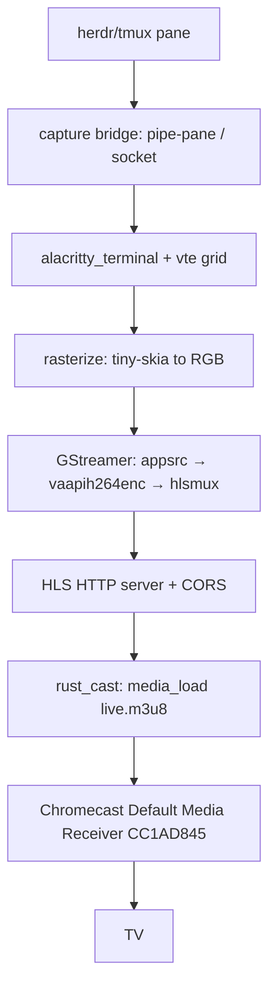

# Spec: cast-tv-terminal — Part 1/4

**Parent-Spec**: `01-cast-tv-terminal.md`
**Part**: 1 of 4
**Covers**: R2 (vte parse → grid), R3 (rasterize), R7 (full-first-then-diff)
**Status**: SPECIFIED — REWRITTEN 2026-08-16. The original Part 1 had an empty
TDD Contract and covered only meta exit criteria (whole-suite pass, quality
gate) — it would have dispatched nothing. This part now builds the terminal
core — emulator grid + rasterizer — which every later part consumes. It also
adopts the render module (R3), which the original 4 parts never assigned.

## Overview

Display the live screen content of the `herdr` terminal multiplexer (a tmux-
compatible mouse-first multiplexer) as a full app window on a TV via a Google
Chromecast on the same LAN. Uses the Default Media Receiver (CC1AD845) + HLS:
capture the pane over a tmux-style pipe/socket bridge, render the terminal grid
to video with alacritty_terminal/vte + GStreamer (H.264, 1080p/60), and cast the
low-latency HLS URL with rust_cast. Avoids a custom Cast receiver app and Google
Cast registration.

---

## Architecture



## Modules in this part

```
src/
├── emu/
│   ├── mod.rs         pub mod term; pub use term::{Cell, Rgb, ScreenFrame};
│   └── term.rs        vte parser → grid, diffed via damage::DamageTracker
├── render/
│   ├── mod.rs         pub mod font; pub mod raster;      (NEW)
│   ├── font.rs        EXISTS — FONT8X8_BASIC glyph table; do not rewrite
│   └── raster.rs      grid → RGB buffer (tiny-skia)      (NEW)
└── lib.rs             MODIFY: add `pub mod emu;` and `pub mod render;`
```

`src/render/font.rs` and `src/font8x8_basic.h` already exist and compile-checked
in earlier work. Reuse `render::font::FONT8X8_BASIC`; do not regenerate it.

## Key Data Structures (owned by this part)

```rust
/// 24-bit RGB. Pack to u32 as 0xRRGGBB when talking to the damage tracker.
#[derive(Debug, Clone, Copy, PartialEq, Eq)]
pub struct Rgb { pub r: u8, pub g: u8, pub b: u8 }

#[derive(Debug, Clone, Copy, PartialEq, Eq)]
pub struct Cell { pub ch: char, pub fg: Rgb, pub bg: Rgb, pub bold: bool }

#[derive(Debug, Clone)]
pub struct ScreenFrame {
    pub width: u16,
    pub height: u16,
    pub cells: Vec<Cell>,   // all cells when full; only changed cells otherwise
    pub full: bool,         // true on the first frame; false on later diffs
}
```

## TDD Contract

| Test Name | Given | Expects |
|-----------|-------|---------|
| `test_vte_parses_ansi_into_grid` | feed `"\x1b[31mX\x1b[0mY"` (SGR red, reset) | `X` cell at cursor with `fg == Rgb{255,0,0}`, `Y` with default fg; both `bold == false` |
| `test_first_frame_is_full` | first `parse_bytes` on a fresh emulator (small size, e.g. 3×2) | returned `ScreenFrame.full == true` and `cells.len() == width * height` |
| `test_subsequent_frames_are_diff` | update one region, then update only one cell of it | 2nd `ScreenFrame.full == false` and `cells` holds only the changed cell |
| `test_rasterize_grid_to_buffer` | small grid (2×2) with known fg/bg, one non-space glyph | buffer of exactly `width*8 * height*8 * 4` bytes (RGBA); bg fills each tile; glyph pixels set to fg |

## Implementation Notes

- **Parser**: implement `vte::Perform` on the emulator struct using
  `alacritty_terminal::vte` (re-exported by alacritty_terminal 0.24 — **no new
  dependency**; vte 0.13 is already in Cargo.lock). Handle at minimum:
  `print` (store char at cursor, advance), `execute` (CR, LF, BS, HT), and
  `csi_dispatch` for **CUP** (cursor position) and **SGR** (fg/bg, bold). OSC
  and the other dispatch hooks may be no-ops.
- **Emulator API**: `Emulator::new()` (default 80×24), `Emulator::with_size(w,h)`,
  `Emulator::parse_bytes(&mut self, bytes: &[u8]) -> ScreenFrame` (parse then
  emit a frame). The grid starts as `' '` (space) with default colors, so the
  first frame is full and deterministic.
- **Diff (R7)**: reuse `damage::DamageTracker`. Convert the grid to
  `(damage::CellKey, damage::CellContent)` — `CellContent.fg`/`.bg` as `u32`
  `0xRRGGBB`, `flags` bit 0 = bold. A fresh tracker damages every cell on its
  first call (→ `full == true`); later calls return only changed cells
  (→ `full == false`). `ScreenFrame.full` is true iff the damaged set is the
  whole grid.
- **Defaults**: ANSI default fg `Rgb{192,192,192}`, bg `Rgb{0,0,0}`. Document
  the choice in a comment. Out-of-range indices return defaults — never panic.
- **Rasterizer (R3)**: `render::raster::rasterize(frame, buffer)` paints the
  whole canvas (`width*8 × height*8` RGBA, stride `width*8*4`): for each cell
  present in `frame.cells`, fill its 8×8 tile with `bg`, then stamp the glyph
  bitmap from `render::font::FONT8X8_BASIC` (MSB = leftmost pixel column of each
  glyph row) tinted `fg`. A `full` frame fills every tile; a diff frame repaints
  only the damaged tiles, leaving the caller's existing buffer untouched
  elsewhere. (tiny-skia is available but a direct byte write is fine and
  simpler — pick whichever you can make correct.)
- No `.unwrap()`, `.expect()`, or `panic!()` in production paths. Write the four
  tests FIRST, then the code that makes them pass.

## Exit Criteria

- [ ] `cargo test --test cast_tv_tests 2>&1 | grep -q "test result: ok"`
- [ ] `test -f src/emu/term.rs && test -f src/emu/mod.rs && test -f src/render/raster.rs && test -f src/render/mod.rs`
- [ ] `grep -q "impl Perform" src/emu/term.rs`
- [ ] `grep -q "FONT8X8_BASIC" src/render/raster.rs`
- [ ] `! grep -rE '\.unwrap\(\)|\.expect\(' src/emu src/render 2>/dev/null | grep -v '//' | grep -v '#\[cfg\(test\)\]' | grep -v test`

## Guardrails

- Do not run `cargo`, `rustc`, `clippy` outside the TDD cycle steps
- Do not add public API surface not specified in Requirements
- Do not use `.unwrap()`, `.expect()`, or `panic!()` in production code paths
- Do not modify files outside the project root
- Do not add dependencies to `Cargo.toml` without explicit approval — this part
  needs none: `vte` is re-exported by `alacritty_terminal` 0.24, which is
  already an approved, non-optional dependency
- **Approved dependencies**: `alacritty_terminal`, `rust_cast`, `gstreamer`,
  `gstreamer-video`, `tiny-skia`, `tokio`, `axum` (or `hyper`), `serde`,
  `serde_json`, `thiserror`
- **PIVOT GUARDRAIL**: do NOT build a custom Cast receiver, register with Google
  Cast, or use WebRTC for the first milestone. If `rust_cast` cannot `media_load`
  HLS onto the device, STOP and report for an explicit Option-2 decision.

On any ambiguity, stop and report back, do not guess.

---
