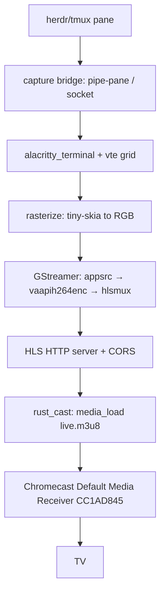

# Spec: cast-tv-terminal — Part 2/4

**Parent-Spec**: `01-cast-tv-terminal.md`
**Part**: 2 of 4
**Covers**: Exit criteria 3, 4

## Overview

Display the live screen content of the `herdr` terminal multiplexer (a tmux-
compatible mouse-first multiplexer) as a full app window on a TV via a Google
Chromecast on the same LAN. Uses the Default Media Receiver (CC1AD845) + HLS:
capture the pane over a tmux-style pipe/socket bridge, render the terminal grid
to video with alacritty_terminal/vte + GStreamer (H.264, 1080p/60), and cast the
low-latency HLS URL with rust_cast. Avoids a custom Cast receiver app and Google
Cast registration.

---

## Architecture

## TDD Contract

| Test Name | Given | Expects |
|-----------|-------|---------|
| `test_cast_load_url_builds_media_load` | device + HLS URL | Cast v2 `media/load` payload (HLS) |
| `test_capture_bridge_feeds_bytes_to_vte` | fake pane emitting bytes | emu screen advances |
| `test_sender_reports_unreachable` | discovery finds no device | clear error (no hang) |

---

## Exit Criteria

- [ ] `test -f src/capture/bridge.rs && test -f src/cast/sender.rs`
- [ ] `grep -q "media/load" src/cast/sender.rs`

## Guardrails

- Do not run `cargo`, `rustc`, `clippy` outside the TDD cycle steps
- Do not add public API surface not specified in Requirements
- Do not use `.unwrap()`, `.expect()`, or `panic!()` in production code paths
- Do not modify files outside the project root
- Do not add dependencies to `Cargo.toml` without explicit approval
- **Approved dependencies**: `alacritty_terminal`, `rust_cast`, `gstreamer`,
  `gstreamer-video`, `tiny-skia`, `tokio`, `axum` (or `hyper`), `serde`,
  `serde_json`, `thiserror`
- **PIVOT GUARDRAIL**: do NOT build a custom Cast receiver, register with Google
  Cast, or use WebRTC for the first milestone. If `rust_cast` cannot `media_load`
  HLS onto the device, STOP and report for an explicit Option-2 decision.

On any ambiguity, stop and report back, do not guess.

---