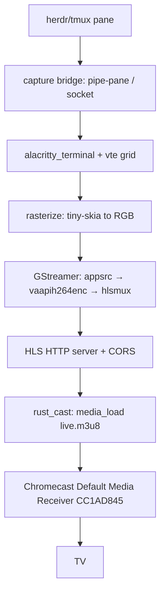

# Spec: cast-tv-terminal — Part 2/4

**Parent-Spec**: `01-cast-tv-terminal.md`
**Part**: 2 of 4
**Covers**: R1 (capture bridge), R6 (cast media_load)
**Status**: SPECIFIED — AMENDED 2026-08-16 (exit criteria made self-contained:
test-ok + file-exists + scoped no-unwrap; notes pinned that both modules must
compile under `cargo test` default features — no `cast`/`gstreamer` feature
required).

## Overview

Display the live screen content of the `herdr` terminal multiplexer (a tmux-
compatible mouse-first multiplexer) as a full app window on a TV via a Google
Chromecast on the same LAN. Uses the Default Media Receiver (CC1AD845) + HLS:
capture the pane over a tmux-style pipe/socket bridge, render the terminal grid
to video with alacritty_terminal/vte + GStreamer (H.264, 1080p/60), and cast the
low-latency HLS URL with rust_cast. Avoids a custom Cast receiver app and Google
Cast registration.

---

## Architecture



## Modules in this part

```
src/
├── capture/
│   ├── mod.rs         pub mod bridge;
│   └── bridge.rs      byte source → emu::Emulator::parse_bytes
├── cast/
│   ├── mod.rs         pub mod sender; pub use sender::{CastError, Sender};
│   └── sender.rs      media_load payload + injected discovery (no hang)
└── lib.rs             MODIFY: add `pub mod capture;` and `pub mod cast;`
```

## TDD Contract

| Test Name | Given | Expects |
|-----------|-------|---------|
| `test_cast_load_url_builds_media_load` | HLS URL | a `serde_json::Value` containing `"type":"LOAD"` and the URL under `media` — i.e. the Cast v2 `media/load` payload |
| `test_capture_bridge_feeds_bytes_to_vte` | fake byte source emitting a VT sequence | `emu::Emulator` screen advances (cells change from blank) after `Bridge::poll()` |
| `test_sender_reports_unreachable` | injected discovery returns Err | `Sender::send_load(url)` returns `Err(CastError::...Unreachable)` promptly (no hang, no network) |

## Implementation Notes

- **Capture bridge (R1)**: `Bridge` reads available bytes from a `ByteSource`
  and feeds them to an `Emulator`. Define a narrow `ByteSource` trait (or accept
  a closure) so the test can inject an in-memory fake; `poll()` consumes what is
  available and returns `usize` (bytes fed) or `Err(BridgeError)`. The real
  tmux/pipe/socket source is a later integration — the trait seam is what this
  part ships.
- **Cast sender (R6)**: the module MUST compile and its two tests MUST pass
  under `cargo test` **default features** (no `cast` feature — `rust_cast` is
  an optional dep). Therefore:
  - `build_media_load_request(url: &str) -> serde_json::Value` is pure and
    unconditional. It must contain the literal `"media/load"` (the Cast v2
    message type) — that is what exit criterion 3 greps for.
  - Real device discovery/session lives behind `#[cfg(feature = "cast")]`.
    `Sender` is constructed with a `Discovery` — a trait or `Box<dyn Fn() ->
    Result<..., CastError>>` — so `test_sender_reports_unreachable` injects a
    discoverer that always fails and asserts a clear `CastError`, never a hang.
- `CastError` is our own type (thiserror). No `.unwrap()`/`.expect()`/`panic!()`
  in production paths.

## Exit Criteria

- [ ] `cargo test --test cast_tv_tests 2>&1 | grep -q "test result: ok"`
- [ ] `test -f src/capture/bridge.rs && test -f src/cast/sender.rs`
- [ ] `grep -q "media/load" src/cast/sender.rs`
- [ ] `! grep -rE '\.unwrap\(\)|\.expect\(' src/capture src/cast 2>/dev/null | grep -v '//' | grep -v '#\[cfg\(test\)\]' | grep -v test`

## Guardrails

- Do not run `cargo`, `rustc`, `clippy` outside the TDD cycle steps
- Do not add public API surface not specified in Requirements
- Do not use `.unwrap()`, `.expect()`, or `panic!()` in production code paths
- Do not modify files outside the project root
- Do not add dependencies to `Cargo.toml` without explicit approval
- **Approved dependencies**: `alacritty_terminal`, `rust_cast`, `gstreamer`,
  `gstreamer-video`, `tiny-skia`, `tokio`, `axum` (or `hyper`), `serde`,
  `serde_json`, `thiserror`
- **PIVOT GUARDRAIL**: do NOT build a custom Cast receiver, register with Google
  Cast, or use WebRTC for the first milestone. If `rust_cast` cannot `media_load`
  HLS onto the device, STOP and report for an explicit Option-2 decision.

On any ambiguity, stop and report back, do not guess.

---
