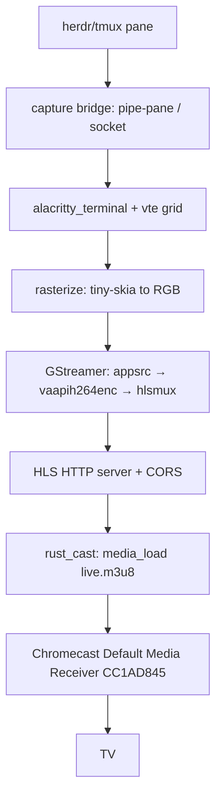

# Spec: cast-tv-terminal — Part 3/4

**Parent-Spec**: `01-cast-tv-terminal.md`
**Part**: 3 of 4
**Covers**: R5 (HLS server + CORS), R4 (H.264 encode pipeline)
**Status**: SPECIFIED — AMENDED 2026-08-16 (TDD now includes
`test_hls_playlist_has_cors` (parent test 5, previously unassigned); exit
criteria made self-contained: test-ok + file-exists + scoped no-unwrap; note
pinned that both modules must compile under `cargo test` default features —
encode is gated behind the `gstreamer` feature). IMPLEMENTED 2026-08-16 —
gate GREEN, review PASS, validate 5/5, EXIT 0, no exit-7 violation.

## Overview

Display the live screen content of the `herdr` terminal multiplexer (a tmux-
compatible mouse-first multiplexer) as a full app window on a TV via a Google
Chromecast on the same LAN. Uses the Default Media Receiver (CC1AD845) + HLS:
capture the pane over a tmux-style pipe/socket bridge, render the terminal grid
to video with alacritty_terminal/vte + GStreamer (H.264, 1080p/60), and cast the
low-latency HLS URL with rust_cast. Avoids a custom Cast receiver app and Google
Cast registration.

---

## Architecture



## Modules in this part

```
src/
├── serve/
│   ├── mod.rs         pub mod server;
│   └── server.rs      axum HTTP server: playlist + segments, CORS headers
├── encode/
│   ├── mod.rs         pub mod pipe;
│   └── pipe.rs        GStreamer H.264 pipeline (gated) + unconditional const
└── lib.rs             MODIFY: add `pub mod serve;` and `pub mod encode;`
```

## TDD Contract

| Test Name | Given | Expects |
|-----------|-------|---------|
| `test_hls_playlist_has_cors` | GET `/live.m3u8` | HTTP 200 + `Access-Control-Allow-Origin` header present |
| `test_served_segment_bytes` | GET a segment path | HTTP 200 + non-empty body |

## Implementation Notes

- **Server (R5)**: an axum router (axum 0.7 is a non-optional dependency).
  Serve a playlist at `/live.m3u8` and segment blobs at `/segment/<name>`; a
  CORS layer (tower-http) must emit `Access-Control-Allow-Origin`. For the tests
  a fixed, in-memory playlist + one static segment byte blob are enough — no
  encoder is needed to pass them. Use `tokio` + `tower_http::cors` (both
  approved, non-optional).
- **Encode (R4)**: the GStreamer pipeline (appsrc → vaapih264enc → hlsmux) is
  NOT compilable under default features — gstreamer crates are optional. Gate
  the real pipeline behind `#[cfg(feature = "gstreamer")]`, and ship an
  unconditional `pub const H264_ENCODER: &str = "h264"` (or equivalent) in
  `pipe.rs` so exit criterion 4 (`grep -qi "h264"`) holds and the module
  compiles everywhere. `encode::mod` must compile under default features.
- No `.unwrap()`, `.expect()`, or `panic!()` in production paths. Router
  handlers return `Result`/`IntoResponse` errors, never panic.

## Exit Criteria

- [ ] `cargo test --test cast_tv_tests 2>&1 | grep -q "test result: ok"`
- [ ] `test -f src/serve/server.rs && test -f src/encode/pipe.rs`
- [ ] `grep -q "Access-Control-Allow-Origin" src/serve/server.rs`
- [ ] `grep -qi "h264" src/encode/pipe.rs`
- [ ] `! grep -rE '\.unwrap\(\)|\.expect\(' src/serve src/encode 2>/dev/null | grep -v '//' | grep -v '#\[cfg\(test\)\]' | grep -v test`

## Guardrails

- Do not run `cargo`, `rustc`, `clippy` outside the TDD cycle steps
- Do not add public API surface not specified in Requirements
- Do not use `.unwrap()`, `.expect()`, or `panic!()` in production code paths
- Do not modify files outside the project root
- Do not add dependencies to `Cargo.toml` without explicit approval
- **Approved dependencies**: `alacritty_terminal`, `rust_cast`, `gstreamer`,
  `gstreamer-video`, `tiny-skia`, `tokio`, `axum` (or `hyper`), `serde`,
  `serde_json`, `thiserror`
- **PIVOT GUARDRAIL**: do NOT build a custom Cast receiver, register with Google
  Cast, or use WebRTC for the first milestone. If `rust_cast` cannot `media_load`
  HLS onto the device, STOP and report for an explicit Option-2 decision.

On any ambiguity, stop and report back, do not guess.

---
