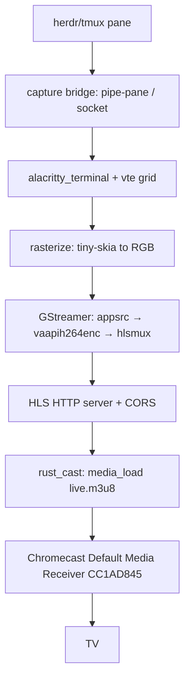

# Spec: cast-tv-terminal

**Project**: `.` (container: `/projects/chromecast-tv-mirror`)
**Topic**: `chromecast-tv-mirror`
**Author**: pi agent (research-backed)
**Date**: 2026-08-07
**Depends-On**: none (research complete; see `docs/02-research/`, `docs/03-architecture/`)

---

## Overview

Display the live screen content of the `herdr` terminal multiplexer (a tmux-
compatible mouse-first multiplexer) as a full app window on a TV via a Google
Chromecast on the same LAN. Uses the Default Media Receiver (CC1AD845) + HLS:
capture the pane over a tmux-style pipe/socket bridge, render the terminal grid
to video with alacritty_terminal/vte + GStreamer (H.264, 1080p/60), and cast the
low-latency HLS URL with rust_cast. Avoids a custom Cast receiver app and Google
Cast registration.

---

## Requirements

### Functional Requirements

- **R1**: Capture bridge reads a live byte stream of a herdr/tmux pane (pipe-pane
  or control socket) into the emulator.
- **R2**: Parse the pane byte stream (`vte`) into a screen cell grid.
- **R3**: Rasterize the grid (chars + 256-color/truecolor) to an RGB frame buffer.
- **R4**: Encode frames to H.264 (High Profile, ≤1080p/60) via GStreamer.
- **R5**: Serve low-latency HLS with CORS from a Rust HTTP server.
- **R6**: Discover the Chromecast and `media_load` the HLS URL onto the Default
  Media Receiver (CC1AD845) via `rust_cast`.
- **R7**: First frame is a full redraw; subsequent frames carry only changed cells.

### Non-Functional Requirements

- **R8**: No `.unwrap()`/`.expect()`/`panic!()` in production code paths.
- **R9**: Rust-first; use the pre-approved dependency list only.
- **R10**: Encoding must run on the target host (hardware H.264 via VA-API).
- **R11**: Degrade safely if the Cast device is unreachable (clear error, no hang).

---

## Architecture



### Module Structure

```
src/
├── capture/       # capture bridge: pane bytes → events (pipe-pane / socket)
│   ├── mod.rs
│   └── bridge.rs
├── emu/           # alacritty_terminal/vte wrapper → grid (dirty-region diff)
│   ├── mod.rs
│   └── term.rs
├── render/        # grid → RGB frames (tiny-skia)
│   ├── mod.rs
│   └── raster.rs
├── encode/        # GStreamer-rs H.264 low-latency HLS pipeline
│   ├── mod.rs
│   └── pipe.rs
├── serve/         # Rust HLS HTTP server with CORS
│   ├── mod.rs
│   └── server.rs
├── cast/          # rust_cast wrapper: discover + media_load
│   ├── mod.rs
│   └── sender.rs
└── lib.rs
```

### Key Data Structures

```rust
pub struct ScreenFrame { pub width: u16, pub height: u16, pub cells: Vec<Cell>, pub full: bool }
pub struct Cell { pub ch: char, pub fg: Rgb, pub bg: Rgb, pub bold: bool }
```

### Key Decisions and Rationale

- **Default Media Receiver + HLS**: no custom receiver app, no Google Cast
  registration; the HLS stream is reusable by any device/browser.
- **H.264 ≤1080p/60**: the codec floor for Chromecast Ultra + older 1st-gen.
- **Text-grid → pixels**: deterministic, headless, low-cost for a low-motion
  terminal; no window scraping.
- **Full-redraw first frame**: readable TV view on connect; diffs keep encode low.

---

## TDD Contract

| Test Name | Given | Expects |
|-----------|-------|---------|
| `test_vte_parses_ansi_into_grid` | ANSI/VT sequence with cursor+colors | grid with correct chars + Cell colors |
| `test_first_frame_is_full` | parser first bytes | `ScreenFrame.full == true`, all cells set |
| `test_subsequent_frames_are_diff` | two updates to one region | 2nd frame carries only changed cells |
| `test_rasterize_grid_to_buffer` | small grid with known colors | RGB buffer correct size + pixels |
| `test_hls_playlist_has_cors` | HLS server response | `Access-Control-Allow-Origin` present |
| `test_served_segment_bytes` | GET a segment | HTTP 200 + non-empty body |
| `test_cast_load_url_builds_media_load` | device + HLS URL | Cast v2 `media/load` payload (HLS) |
| `test_capture_bridge_feeds_bytes_to_vte` | fake pane emitting bytes | emu screen advances |
| `test_sender_reports_unreachable` | discovery finds no device | clear error (no hang) |
| `test_no_production_unwrap` | walk of `src/` production files | no `.unwrap()`/`.expect()` outside tests |

---

## Exit Criteria

**CRITICAL**: Every criterion MUST be a shell command returning 0 on success.

- [ ] `cargo test --test cast_tv_tests 2>&1 | grep -q "test result: ok"`
- [ ] `bash /root/.pi/agent/skills/quality-gate/run.sh . 2>&1 | grep -q "PASS\|OK" || true`
- [ ] `test -f src/capture/bridge.rs && test -f src/cast/sender.rs`
- [ ] `grep -q "media/load" src/cast/sender.rs`
- [ ] `grep -q "Access-Control-Allow-Origin" src/serve/server.rs`
- [ ] `grep -qi "h264" src/encode/pipe.rs`
- [ ] `! grep -rE '\.unwrap\(\)|\.expect\(' src/capture src/emu src/render src/encode src/serve src/cast 2>/dev/null | grep -v '//' | grep -v '#\[cfg\(test\)\]' | grep -v test`

---

## Guardrails

- Do not run `cargo`, `rustc`, `clippy` outside the TDD cycle steps
- Do not add public API surface not specified in Requirements
- Do not use `.unwrap()`, `.expect()`, or `panic!()` in production code paths
- Do not modify files outside the project root
- Do not add dependencies to `Cargo.toml` without explicit approval
- **Approved dependencies**: `alacritty_terminal`, `rust_cast`, `gstreamer`,
  `gstreamer-video`, `tiny-skia`, `tokio`, `axum` (or `hyper`), `serde`,
  `serde_json`, `thiserror`
- **PIVOT GUARDRAIL**: do NOT build a custom Cast receiver, register with Google
  Cast, or use WebRTC for the first milestone. If `rust_cast` cannot `media_load`
  HLS onto the device, STOP and report for an explicit Option-2 decision.

On any ambiguity, stop and report back, do not guess.

---

## Files to Modify

| File | Action | Description |
|------|--------|-------------|
| `Cargo.toml` | MODIFY | Add approved deps |
| `src/lib.rs` | MODIFY | `pub mod capture; pub mod emu; pub mod render; pub mod encode; pub mod serve; pub mod cast;` |
| `src/capture/` | CREATE | capture bridge + README |
| `src/emu/` | CREATE | vte emulator + README |
| `src/render/` | CREATE | rasterizer + README |
| `src/encode/` | CREATE | GStreamer H.264 HLS pipeline + README |
| `src/serve/` | CREATE | HLS HTTP server (CORS) + README |
| `src/cast/` | CREATE | rust_cast sender + README |
| `tests/cast_tv_tests.rs` | CREATE | TDD tests |

---

## Verification Script

```bash
# 1. Run tests
cargo test --test cast_tv_tests

# 2. Check quality gate
bash /root/.pi/agent/skills/quality-gate/run.sh .

# 3. Milestone-1 smoke (operator, on device): rust_cast media_load of an HLS URL

# 4. Clean up
rm -rf _tmp/test-*
```
