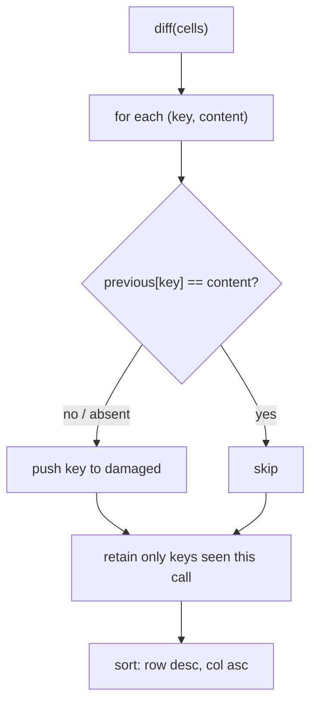

# cast-tv-terminal — spec-02: Terminal cell damage tracker

- **Project**: `/projects/chromecast-tv-mirror`
- **Priority**: the crate does not build its test target, and every frame path
  needs this to avoid redrawing the whole grid.
- **Status**: SPECIFIED — not yet dispatched
- **Source**: `HANDOFF.md` — "No public damage API in 0.24.2 → own diff via
  HashMap of last cells" (2026-08-14)
- **Depends-On**: none

---

## Overview

Two problems, one small change.

**The crate is broken at baseline.** `Cargo.toml` declares an integration test
target at `tests/cast_tv_tests.rs`, and that file does not exist, so
`cargo test` fails with a target-resolution error before compiling anything.
Verified by running the quality gate.

**And there is no damage tracking.** `alacritty_terminal` 0.24.2 exposes no
public damage API, so the renderer would repaint every cell every frame. The
`HANDOFF.md` conclusion — own the diff — is what this implements.

This spec adds a **pure, dependency-free** damage tracker and the missing test
file. No terminal types, no rendering, no I/O: given the previous and current
contents of a grid, say which cells changed.

Verified premises: `src/render/font.rs` is the only source file; there is no
`src/lib.rs`; `[dependencies]` already includes what the crate needs and this
adds none.

---

## Requirements

### Functional

- **D1 (types)**: `pub struct CellKey { pub row: i32, pub col: usize }` deriving
  `Debug, Clone, Copy, PartialEq, Eq, Hash`, and
  `pub struct CellContent { pub ch: char, pub fg: u32, pub bg: u32, pub flags: u8 }`
  deriving `Debug, Clone, Copy, PartialEq, Eq`.
  `row` is `i32` because visible rows run `0` down to `-(rows-1)`.
- **D2 (tracker)**: `pub struct DamageTracker` with `pub fn new() -> Self` and
  `pub fn diff(&mut self, cells: &[(CellKey, CellContent)]) -> Vec<CellKey>`,
  returning the keys whose content differs from the previous call, plus keys
  seen for the first time.
- **D3 (first call)**: on the first `diff`, **every** supplied key is damaged —
  nothing has been drawn yet.
- **D4 (unchanged is empty)**: calling `diff` twice with identical input returns
  an empty `Vec` the second time.
- **D5 (removed cells)**: a key present in the previous call and absent from the
  current one is **not** reported as damaged, and is forgotten — a later
  reappearance counts as first-time damage.
- **D6 (deterministic order)**: the returned keys are sorted by `row` descending
  then `col` ascending, so output is stable across runs. A `HashMap` iteration
  order must not leak into the result.
- **D7 (reset)**: `pub fn reset(&mut self)` forgets all state, so the next
  `diff` damages everything.

### Non-Functional

- **N1**: **no new dependencies.** `[dependencies]` in `Cargo.toml` is unchanged.
- **N2**: no panics; no `unwrap()`, `expect()` or `panic!` in the module.
- **N3**: the quality gate passes — which requires `tests/cast_tv_tests.rs` to
  exist, since `Cargo.toml` declares it.
- **N4**: `src/render/font.rs` is not modified.
- **N5**: no hardcoded absolute paths.

---

## Architecture

**Key decision — the tracker owns a `HashMap<CellKey, CellContent>` and nothing
else.** No reference to `alacritty_terminal` types, so this is testable without
a terminal, and a change to that crate cannot break it. The caller converts.

**Key decision — sort the output** (D6). `HashMap` iteration order varies
between runs; a renderer fed an unstable order produces diffs that are hard to
reason about and tests that flake.

**What this spec is not**: no rendering, no font work, no GStreamer, no cast
discovery, and no `alacritty_terminal` integration. Those come later and are
explicitly out of scope.

---

## TDD Contract

| id | test | given | expects |
|----|------|-------|---------|
| D3 | `test_first_diff_damages_everything` | 3 cells, first call | all 3 keys |
| D4 | `test_identical_second_call_is_empty` | same 3 cells twice | second call empty |
| D2a | `test_changed_char_is_damaged` | one cell's `ch` changes | exactly that key |
| D2b | `test_changed_colour_is_damaged` | one cell's `fg` changes | exactly that key |
| D2c | `test_new_key_is_damaged` | a 4th cell appears | exactly the new key |
| D5a | `test_removed_key_is_not_damaged` | a cell disappears | empty result |
| D5b | `test_reappearing_key_is_damaged` | cell removed, then returns | that key damaged. **The acceptance test** |
| D6 | `test_order_is_deterministic` | 20 cells across rows/cols, changed | sorted row desc, col asc; identical across two runs |
| D7 | `test_reset_damages_everything` | diff, reset, diff same input | all keys damaged |
| N3 | `cargo test` compiles the declared target | `tests/cast_tv_tests.rs` exists | gate passes |

**D5b is the acceptance test.** The obvious implementation keeps stale entries
forever, so a reappearing cell compares equal to its long-gone value and is
reported unchanged — a cell that silently never repaints. D5a and D5b only pass
together if removed keys are genuinely forgotten.

---

## Exit Criteria

- [ ] `cargo test` — passes, including the declared `cast_tv_tests` target (N3)
- [ ] `cargo clippy -- -D warnings` — clean
- [ ] `cargo fmt -- --check` — formatted
- [ ] `test -f tests/cast_tv_tests.rs` — the missing test file exists (N3)
- [ ] `grep -q 'pub struct DamageTracker' src/damage.rs` — the tracker exists (D2)
- [ ] `grep -q 'pub fn reset' src/damage.rs` — reset exists (D7)
- [ ] `! grep -qE 'unwrap\(\)|expect\(|panic!' src/damage.rs` — no panicking calls (N2)
- [ ] `git diff --quiet -- src/render/font.rs` — font.rs untouched (N4)
- [ ] `git diff --quiet -- Cargo.toml` — no dependency added (N1)

**Prose criteria**:

1. Quote the gate's four stage results before and after — it fails at baseline
   on the missing test target.
2. Test counts pasted raw, one line per binary, **unsummed**.

---

## Guardrails

- **G1 — do NOT edit this spec.** If it is wrong, reply with a first line of
  `SPEC-DEFECT: 
`.
- **G2 — do NOT commit.**
- **G3 — do NOT add a dependency, and do not edit `Cargo.toml`** (N1). The test
  target is already declared; create the file it points at.
- **G4 — do NOT touch `src/render/font.rs`** (N4).
- **G5 — do NOT import `alacritty_terminal`** in the damage module. It must be
  testable without a terminal.
- **G6 — do NOT weaken, skip or delete a test.**
- **G7 — report raw output, never summed totals.**

### Error handling expectations

`diff` takes a slice and returns a `Vec`; it has no failure mode and must not
acquire one. Duplicate keys in a single call are last-write-wins, not a panic.

---

## Files to Modify

| File | Change |
|------|--------|
| `src/lib.rs` | **NEW** — declares `pub mod damage;` |
| `src/damage.rs` | **NEW** — `CellKey`, `CellContent`, `DamageTracker` (D1–D7) |
| `tests/cast_tv_tests.rs` | **NEW** — the TDD Contract above |

**Not modified**: `Cargo.toml`, `src/render/font.rs`, anything under
`.orchestration/` or `.claude/`.
