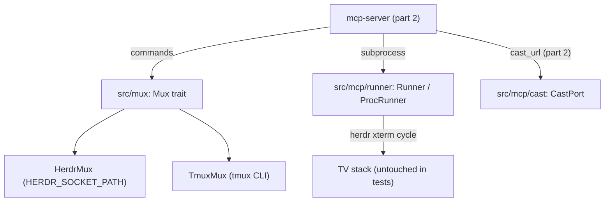

# chromecast-tv-mirror — spec-03: mcp-server (part 1/3)

- **Project**: `/projects/chromecast-tv-mirror`
- **Priority**: foundation of the MCP-over-stdio Chromecast control server — the mux layer and the server's process/config/cast seams, before any tool surface
- **Status**: SPECIFIED — not yet dispatched · *(lifecycle: SPECIFIED → IN PROGRESS
  on dispatch → IMPLEMENTED — awaiting review → DONE after the orchestrator
  commits and updates HANDOFF.md)*
- **Source**: operator requirement: MCP-over-stdio Chromecast control server; split of specs/03-mcp-server.md after two stalled workhorse runs (2026-08-16)
- **Depends-On**: spec-01 (reuses `src/cast` + the gate/test conventions), spec-02 (keeps the rustix `std` pin and the no-unwrap meta-test). This is part 1 of 3 of spec-03 — the master spec `specs/03-mcp-server.md` is the source of truth.

---

## Verified Premises

<Every load-bearing claim was re-checked in the tree on 2026-08-16, after the
master spec was authored.>

- `src/lib.rs:4-11` — public modules are exactly `capture, cast, damage, emu,
  encode, pipeline, render, serve`; there is no `mcp` or `mux` module yet.
- `Cargo.toml:7-34` — deps: alacritty_terminal 0.24, tiny-skia 0.11, tokio 1
  (full), axum 0.7, tower-http (cors), serde+serde_json, thiserror, bytes,
  base64, log 0.4, `rustix 0.38.44` pinned with `std` (spec-02 pin); optional
  `rust_cast 0.17`; features `default=[]`, `gstreamer`, `cast`. **No rmcp.**
- `Cargo.toml:36-38` — one `[[test]]` target: `cast_tv_tests`. `mcp_tests` does
  not exist yet.
- `src/cast/session.rs:60-66` — `pub fn send_media_load(&DeviceAddr, &str, &str,
  StreamType) -> Result<(), CastError>`; `pub use rust_cast::channels::media::StreamType`
  (line 11). Whole module `#[cfg(feature="cast")]`.
- `src/cast/sender.rs:34-35` — `DeviceAddr::new(host)` sets port 8009.
- `tests/cast_tv_tests.rs:646-717` — `test_no_production_unwrap` walks
  `module_dirs = [capture,emu,render,encode,serve,cast]` and asserts
  `checked_dirs.len() == 6` ("all six module dirs must have been walked").
- Live runtime (verified 2026-08-16): tv-demo herdr socket
  `/root/.config/herdr/sessions/tv-demo/herdr.sock`; tabs `w1:t1` (htop) +
  `w1:t2`; HLS dir `/tmp/m2/xhls`; display `xterm … -fs 13 -geometry 116x32+0+0
  -e /bin/sh -c 'exec herdr --session tv-demo'` on `DISPLAY=:99`. The parent env
  carries `HERDR_ENV=1` + `HERDR_SOCKET_PATH=<default-session socket>` — the
  nested-herdr hazard.
- rmcp 3.1.2 (docs.rs latest): features `server`,`macros`,`transport-io`,
  `schemars`. `#[tool]`/`#[tool_router]`/`#[tool_handler]`, `RoleServer`,
  `CallToolResult::success/error`, `ServiceExt::serve(stdio())` then
  `.waiting()`. Its rustix tree must be checked against the spec-02 pin (G9).

---

## Overview

Spec-03 is the MCP-over-stdio server that lets an AI agent control the
Chromecast and the TV terminal stack and see its work live. The full spec
(`specs/03-mcp-server.md`) stalled on the workhorse twice — run #2 made 52 tool
calls and wrote zero files. It is split into three parts. **This is part 1: the
layer every other part builds on** — the dual-driver mux module (herdr + tmux,
the operator's explicit requirement), the server's process/config/cast seams,
and the error type, plus the unit tests that pin them. It also declares the
`rmcp` dependency and proves it resolves against the rustix pin *before* any
tool surface is written on top.

The riskiest seam in this part is the **process seam**: the parent environment
carries `HERDR_ENV=1` and a `HERDR_SOCKET_PATH` pointing at the operator's live
default herdr session. A naive child spawned by the server inherits those and
silently drives the wrong session — or, with stdio inherited, corrupts the MCP
protocol (part 3 proves that end-to-end). The acceptance test for this part is
`test_runner_removes_herdr_env`.

---

## Requirements

Implements the master spec's R2 (mux), the R3 cast *foundation* (the port and
stream-type mapping; the `cast_url` *tool* is part 2), the R4 shell-quote
helper, the R10 error type, and the N1–N6 scaffolding. R1/R4–R9 *tool surfaces*
and the R10 *acceptance E2E* are parts 2 and 3.

### Functional

- **R2 (mux module, dual-driver)**: `src/mux/` defines a shared `Mux` trait and
  exactly two drivers — `HerdrMux` (herdr socket CLI, JSON stdout) and
  `TmuxMux` (tmux `-F` formatted output) — selected by env `MUX` (default
  `herdr`) in `mux::open()`. `open()` constructs the driver **without touching
  the socket/server**; the first command is when a missing socket or server is
  discovered (lazy failure — a missing socket must yield an `Err(MuxError)` on
  a command, never a crash at construction; part 3's E2E error test depends on
  this). The trait methods are `ensure_window`, `focus`, `send_text`,
  `run_command`, `close_window`, `list_windows`, `list_panes`, `attach_shell`
  (per the master spec). Both drivers satisfy the same contract; contract tests
  run against BOTH.
- **R4 (shell_single_quote helper)**: pure function in `src/mux/mod.rs` —
  strip control chars (keep `\n`/`\t`), escape `'` → `'\''`, wrap in `'…'`. The
  one place arbitrary agent text becomes safe in a window's shell.
- **R3 (cast port foundation)**: in `src/mcp/cast.rs` — `CastUrlArgs`, the
  `CastPort` closure, `production_cast_port()` (real `send_media_load` only
  inside `#[cfg(feature="cast")]`, a stub error naming "without the cast
  feature" otherwise), and `stream_type_for(ct)`/`parse_stream_type`:
  `image/*`→NONE, `video/mp4`→BUFFERED, else LIVE. `StreamType`/rust_cast types
  never appear outside the `cfg(cast)` body — the closure takes `&str`.
- **R10 (error type)**: `src/mcp/errors.rs` — `McpServerError` (thiserror) with
  variants for mux, cast, runner, config/arg, and internal errors. Used by the
  runner, config and cast modules now, and by every tool in part 2.

### Non-Functional

- **N1**: no `.unwrap()`/`.expect()`/`panic!()` in `src/mcp` or `src/mux`. The
  meta-test `test_no_production_unwrap` is extended in THIS part to walk 8 dirs
  (6→8), so the guarantee holds from the first part onward.
- **N2**: the only new dependency is `rmcp = { version = "3", features =
  ["server","macros","transport-io","schemars"] }`, added in this part. No
  clap/anyhow; no dev-dependencies; the spec-02 rustix `std` pin stays.
- **N3**: gates stay green — `cargo build --features cast,gstreamer`, `cargo
  test`, `cargo clippy --all-targets -- -D warnings`, `cargo fmt -- --check` —
  and the test count only goes up.
- **N4 (process seam)**: `Runner::spawn_detached` nulls the child's
  stdin/stdout/stderr and sets `process_group(0)` so a child can neither corrupt
  a protocol nor die with the server.
- **N5 (isolation)**: `ProcRunner` captures the parent's `HERDR_*` keys at
  construction and removes them on every `run`/`spawn_detached`, then applies
  the per-call env — the server only ever talks to the configured socket.
- **N6**: no hardcoded absolute paths in production code — every runtime
  path/value comes from env with documented defaults (config in this part).

---

## Architecture



**Key decision — Mux trait over protocol-specific backends.** All display work
calls the `Mux` trait; `HerdrMux` and `TmuxMux` implement it. **Rejected:**
tools calling the herdr CLI directly. The operator's requirement is explicit —
herdr with tmux compatibility — and a future full-screen "card" backend is a
third impl, no tool changes.

**Key decision — Runner process seam.** All subprocess work goes through
`Runner { run, spawn_detached }` with `ProcRunner` production semantics:
remove every captured `HERDR_*` env key, apply per-call env (always
`HERDR_SOCKET_PATH=<configured socket>` for herdr; `DISPLAY=<X>` for xterm),
null stdio, `process_group(0)`. **Rejected:** tools spawning
`std::process::Command` inline — that is what made the nested-herdr bug and
stdio corruption possible, and it is untestable.

**Key decision — lazy mux construction.** `mux::open()` never touches the
socket/server; commands do. A missing socket must surface as a tool `is_error`
result (part 3) rather than a server that fails to start.

**What this part is not**: the `McpServer` struct, any tool, `ServerHandler`,
`serve_stdio`, `bin/mcp-server.rs`, `display.rs`/`status.rs`, the E2E stdio
tests, and the acceptance test — those are parts 2 and 3. `src/mcp/mod.rs`
exists here ONLY to declare the submodules.

### Runner seam (the shapes the tests depend on)

```rust
pub struct CommandOutcome { pub status: i32, pub stdout: String, pub stderr: String }
pub trait Runner: Send + Sync {
    /// Run to completion; capture stdout/stderr. `remove_env` keys are
    /// stripped, then `env` applied, before exec.
    fn run(&self, argv: &[&str], env: &[(String, String)],
           remove_env: &[&str]) -> Result<CommandOutcome, McpServerError>;
    /// Detached spawn; stdio nulled, own process group; returns the child pid.
    fn spawn_detached(&self, argv: &[&str], env: &[(String, String)],
                      remove_env: &[&str]) -> Result<u32, McpServerError>;
}
```

`ProcRunner` (the only impl) records the `HERDR_*` keys present in the process
env at construction (`env::vars().filter(|(k,_)| k.starts_with("HERDR_"))`) and
adds them to `remove_env` on every call. It also carries `HERDR_ENV` itself in
that set. The `FakeRunner` in tests scripts a queued `CommandOutcome` and logs
every `(cmd, args, env, remove_env)` call.

### Config (env, all with defaults)

`MUX` (herdr), `MUX_SESSION` (tv-demo), `MUX_SOCKET`
(`/root/.config/herdr/sessions/tv-demo/herdr.sock`), `MUX_WORKSPACE` (w1),
`MUX_AGENT_LABEL` (agent), `MUX_CYCLE_LABELS` (1,watch), `MUX_FOCUS_SECS` (10),
`CAST_DEVICE` (10.10.10.208), `HLS_DIR` (`/tmp/m2/xhls`), `CYCLE_PID_FILE`
(`/tmp/m2/tv_cycle.pid`), `X_DISPLAY` (:99), `XTERM_GEOMETRY` (116x32+0+0).

---

## TDD Contract

New `[[test]]` target `tests/mcp_tests.rs` (no dev-deps; `FakeRunner` scripts a
queued `CommandOutcome` and logs every `(cmd,args,env,remove_env)` call). Mux
contract tests run against BOTH drivers.

| id | test | given | expects |
|----|------|-------|---------|
| R2 | `test_mux_contract_both_drivers` | same canned inputs to `HerdrMux` and `TmuxMux` | both ensure/focus/run/list; per-driver argv (`herdr tab …` vs `tmux …`); identical `WindowInfo`/`PaneInfo` |
| R2 | `test_mux_malformed_output` | herdr garbage JSON / tmux non-zero exit | `Err(MuxError)` containing the raw output; no panic |
| R2,R4 | `test_herdr_commands_and_env` | `FakeRunner` scripted `tab list`→empty, `tab create`, re-list→`w1:t9`, `pane list` | exact argv: `tab list` → `tab create --workspace w1 --label agent --no-focus` → `tab list` → `tab focus w1:t9` → `pane run w1:p9 "printf '%s\n' '…'"`; every call has `HERDR_SOCKET_PATH` set and no inherited `HERDR_*` keys |
| R4 | `test_shell_single_quote` | `it's here`, plus NUL/control bytes | `'it'\''s here'`; control chars stripped except `\n`/`\t` |
| R3 | `test_stream_type_for_mapping` | `image/jpeg`, `video/mp4`, `application/vnd.apple.mpegurl` | `NONE`, `BUFFERED`, `LIVE` |
| R3 | `test_cast_port_stub_without_cast` (`#[cfg(not(feature="cast"))]`) | call `production_cast_port()` | `Err` containing `"without the cast feature"` |
| N6 | `test_config_from_env_defaults` | env cleared of the MUX_*/CAST_*/HLS_* keys | defaults match the live tv-demo values (socket, session, device, HLS dir, geometry) |
| N4,N5 | `test_runner_removes_herdr_env` | `ProcRunner` runs `sh -c 'env'` with `HERDR_ENV`+`HERDR_SOCKET_PATH` present in the process env | captured stdout has neither key; a scripted call records `remove_env` ⊇ `HERDR_ENV`; `spawn_detached` sets null stdio + its own process group |
| N1 | `test_no_production_unwrap` (extend existing) | `module_dirs += "src/mcp", "src/mux"`; `checked_dirs.len() == 8` | meta-test passes |

**N4/N5 (acceptance test) — `test_runner_removes_herdr_env`.** This is the
requirement a plausible implementation satisfies in appearance only: a `Runner`
that wraps `Command::new` but forgets `env_remove` passes unit tests that use a
scripted fake, and the defect only shows up against the live operator session —
the server silently driving the wrong herdr socket. The test exercises the
REAL `ProcRunner` against `env` and asserts the inherited `HERDR_*` keys are
gone from the child. (For `test_runner_removes_herdr_env`, the real
`ProcRunner` is required; every other test in this table uses `FakeRunner`.)

---

## Exit Criteria

- [ ] `cargo build` — default features compile (N2)
- [ ] `cargo build --features cast` — cast-enabled compile (R3)
- [ ] `cargo build --features cast,gstreamer` — full feature set compiles (N3)
- [ ] `cargo test` — whole suite incl. the `mcp_tests` target (N3)
- [ ] `cargo test --test mcp_tests 2>&1 | grep -qE "^test result: ok\. [1-9]"` — the new target actually ran ≥1 passing test (non-vacuous) (R2-R10)
- [ ] `cargo test --quiet test_no_production_unwrap 2>&1 | grep -qE "^test result: ok\. [1-9]"` — meta-test now walks `src/mcp`+`src/mux` (N1, non-vacuous)
- [ ] `test -f src/mux/herdr.rs && test -f src/mux/tmux.rs && grep -q "pub trait Mux" src/mux/mod.rs` — both drivers + the trait exist (R2)
- [ ] `grep -q 'rmcp' Cargo.toml && grep -q 'mcp_tests' Cargo.toml` — dependency + test target declared (N2)
- [ ] `cargo clippy --all-targets -- -D warnings` — clean (N3)
- [ ] `cargo fmt -- --check` — formatted (N3)
- [ ] `! grep -rn 'println!(\|print!(' src/mcp src/mux` — no stdout writes in part-1 code (N4)
- [ ] `! grep -rn '/projects/chromecast-tv-mirror\|/root/' src/mcp src/mux` — no hardcoded absolute paths (N6)
- [ ] `! git diff --name-only | grep -qE 'specs/(01|02)-|^src/(capture|emu|render|encode|serve|cast)/'` — prior pipeline modules and specs untouched (N1)

**Prose criteria:**

1. The rmcp dependency resolves (`cargo build` above) WITHOUT removing the
   spec-02 rustix pin. If rmcp's rustix tree conflicts with the pin, do NOT
   remove it — stop and report (G9).
2. Test counts pasted raw, one line per binary, **unsummed**.

---

## Guardrails

- **G1 — do NOT edit this spec, or the master spec `specs/03-mcp-server.md`.** If
  either is wrong, STOP and report it to the orchestrator.
- **G2 — do NOT commit.** Leave work in the working tree.
- **G3 — do NOT weaken, skip or delete an existing test.**
- **G4 — do NOT regenerate a pinned fixture.**
- **G5 — no hardcoded absolute paths in production code.** Test artefacts under
  env temp or `_tmp/`.
- **G6 — report raw output, never summed totals.**
- **G7 — do NOT touch the operator's live default herdr session, and do NOT kill
  operator processes** (Xvfb, ffmpeg, hls_server, the herdr server, or the
  running cycle loop). Tests in this part never talk to the live stack.
- **G8 — do NOT install system packages** (tmux, fonts, etc.). The tmux driver
  is contract-tested against a fake Runner only.
- **G9 — do NOT run `cargo add`.** Edit `Cargo.toml` directly; keep the spec-02
  rustix `std` pin. If rmcp's rustix conflicts, report it — never remove the pin.
- **G10 — stdio discipline.** Children spawned by `Runner` must not inherit the
  server's stdio (null it) and must be in their own process group.

### Error handling expectations

Fail loudly, never silently:
- Missing/unreachable mux socket or tmux server → `Err(MuxError)` from the
  offending COMMAND, naming the socket/session; never a panic; never a failure
  at `mux::open()` construction.
- Non-zero mux exit or malformed herdr JSON → `Err(MuxError)` with the raw
  stdout/stderr included, so a wrong premise is diagnosable.
- `cast` feature absent → the stub `Err` names "without the cast feature".
- `pgrep` with no match → treated as absence (fine), never an error (part 2).
- Config keys missing → documented defaults; unknown `MUX` value → hard error
  from `mux::open()` naming the accepted values.

---

## Files to Modify

| File | Change |
|------|--------|
| `Cargo.toml` | add `rmcp = { version = "3", features = ["server","macros","transport-io","schemars"] }`; add `[[test]] name="mcp_tests" path="tests/mcp_tests.rs"` (R2,N2) |
| `src/lib.rs` | add `pub mod mcp;` and `pub mod mux;` (R2) |
| `src/mux/mod.rs` | new — Mux trait, MuxError, Target/Pane/WindowInfo/PaneInfo, MuxKind, driver factory `open()`, `shell_single_quote` (R2,R4) |
| `src/mux/herdr.rs` | new — `HerdrMux` driver (R2) |
| `src/mux/tmux.rs` | new — `TmuxMux` driver (R2) |
| `src/mcp/mod.rs` | new — submodule declarations ONLY (`config`, `errors`, `runner`, `cast`); the `McpServer` struct is part 2 (R10) |
| `src/mcp/errors.rs` | new — `McpServerError` (thiserror) (R10) |
| `src/mcp/config.rs` | new — `Config` + `from_env()` (N6) |
| `src/mcp/runner.rs` | new — `Runner` trait + `ProcRunner` (N4,N5) |
| `src/mcp/cast.rs` | new — `CastUrlArgs`, `CastPort`, `production_cast_port()`, `stream_type_for()`, `parse_stream_type()` (R3) |
| `tests/mcp_tests.rs` | new — part-1 unit tests (R2-R10) |
| `tests/cast_tv_tests.rs` | EDIT — `test_no_production_unwrap` module list += `"src/mcp","src/mux"`, `checked_dirs.len()` 6→8 only (N1) |

**Not modified**: `src/capture|emu|render|encode|serve|cast/`,
`src/bin/castctl.rs`, `src/bin/mirror.rs`, `specs/01-*`, `specs/02-*`,
`specs/03-mcp-server.md` (master — orchestrator owns it), `.orchestration/`,
`HANDOFF.md`, `docs/`.
