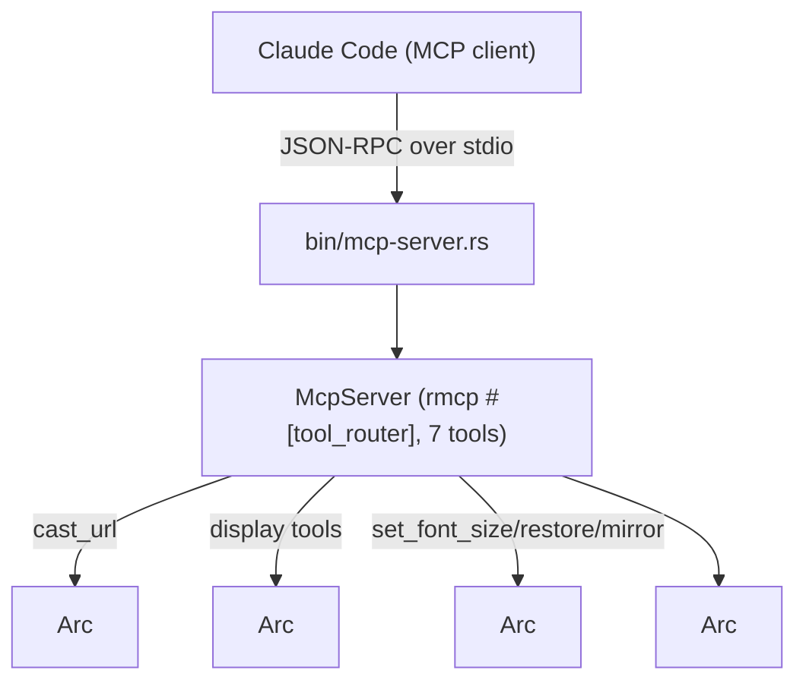

# chromecast-tv-mirror — spec-03: mcp-server (part 2/3)

- **Project**: `/projects/chromecast-tv-mirror`
- **Priority**: the tool surface of the MCP server — the `McpServer` struct, all seven tools, and the stdio entrypoint, built on part 1's mux/foundation seams
- **Status**: **DONE** — implemented by pi-workhorse (deepseek-v4-flash),
  orchestrator-reviewed and committed 2026-08-17 (commit `3f75787`); 13/13 exit
  criteria green; HANDOFF updated. Next: part 3 (E2E stdio tests). · *(lifecycle:
  SPECIFIED → IN PROGRESS on dispatch → IMPLEMENTED — awaiting review → DONE
  after the orchestrator commits and updates HANDOFF.md)*
- **Source**: operator requirement: MCP-over-stdio Chromecast control server; split of specs/03-mcp-server.md after two stalled workhorse runs (2026-08-16)
- **Depends-On**: **`specs/03-mcp-server-part1.md` MUST have landed first** (its `src/mux/`, `src/mcp/{errors,config,runner,cast}.rs`, Cargo.toml `rmcp`+`[[test]]`, and the 6→8 meta-test are all required here). The master spec `specs/03-mcp-server.md` is the source of truth.

---

## Verified Premises

<The load-bearing claims below were checked in the tree on 2026-08-16. Part 2
assumes part 1 has landed and re-checks only what it touches.>

- Part 1 provides: `Mux` trait + `HerdrMux`/`TmuxMux` with lazy `open()`; `Runner`
  trait + `ProcRunner` (removes inherited `HERDR_*` keys, nulls stdio, own
  process group); `Config::from_env()`; `McpServerError`; `CastPort` +
  `production_cast_port()` + `stream_type_for()`; `tests/mcp_tests.rs` with a
  `FakeRunner` (scripted `CommandOutcome` + call log) and `FakeCastPort`
  (records `(host,url,ct,st)`).
- The existing `[[test]] cast_tv_tests` meta-test already walks 8 dirs after
  part 1, so `src/mcp/display.rs` + `src/mcp/status.rs` added here are covered
  with no further edit (both stay under `src/mcp`).
- Live runtime (verified 2026-08-16, for config defaults only — this part's
  tests never touch it): tv-demo socket
  `/root/.config/herdr/sessions/tv-demo/herdr.sock`; tabs `w1:t1` (htop) +
  `w1:t2` (`watch`); HLS dir `/tmp/m2/xhls`; cycle loop = a detached
  `bash -c 'while true; do … tab focus …; sleep 10; …; done'`; display xterm:
  `xterm -class XTerm -fa 'DejaVu Sans Mono' -fs 13 -geometry 116x32+0+0 -xrm
  XTerm*{scrollBar,menuBar,internalBorder,background,foreground}… -T herdr-tv -e
  /bin/sh -c 'exec herdr --session tv-demo'` on `DISPLAY=:99`; `pgrep -f` on the
  xterm matches its `-T herdr-tv` title.
- rmcp 3.1.2 API (per rust-sdk `main` examples): `#[tool]`/`#[tool_router]`/
  `#[tool_handler]`, `RoleServer`, `ServerHandler`, `CallToolResult::success/
  error`, `ServiceExt::serve(stdio())` then `.waiting()`. Tool methods are
  `async fn` on a `#[derive(Clone)]` struct; the router is built from an
  inherent `impl` block (pi's run-#2 research recorded this; see
  `HANDOFF-incomplete.md`).

---

## Overview

Part 1 delivered the seams; **this part delivers the server**: the `McpServer`
struct that implements the `Mux`-driven tools, the `ServerHandler` with
`serve_stdio()`, and the `bin/mcp-server.rs` entrypoint. Seven tools are
registered: `cast_url`, `cast_text`, `run_command`, `set_font_size`,
`pipeline_status`, `restore`, `mirror_session`. Every tool returns
`CallToolResult`; an operational failure is an `is_error` result, never a
crash; only genuinely unexpected internal state maps to a JSON-RPC error.

The two things a plausible implementation gets wrong here are (a) `println!` or
`eprintln!`-to-stdout from the server process — corrupting the MCP protocol
stream (part 3 proves it over a real pipe), and (b) `set_font_size`/`restore`
spawning children that inherit the parent's `HERDR_*` env and silently drive
the wrong herdr session. Part 1's Runner seam exists so neither is possible
without deliberate effort; this part's tests pin the tool-level behaviour with
`FakeRunner`/`FakeMux`/`FakeCastPort` — no live stack, no real xterm, no real
herdr.

---

## Requirements

Implements the master spec's R1 (server surface), R3 (cast_url *tool*), R4–R9
(tools), R10 (error surface — handler layer), and re-asserts N1–N6. The R1/R10
*acceptance E2E* over a real stdio pipe is part 3.

### Functional

- **R1 (server struct + stdio entrypoint)**: `src/mcp/mod.rs` (replacing part
  1's submodule-decl version, keeping those decls) defines `McpServer`
  (`#[derive(Clone)]`, holding `Arc<Config>`, `Arc<dyn Runner>`,
  `Arc<dyn Mux>`, `Arc<dyn CastPort>`), a `#[tool_router]` over an inherent
  `impl` block registering **all seven tools**, a `#[tool_handler]`
  `ServerHandler`, and `serve_stdio()` (`server.serve(stdio()).await?.
  waiting().await?`). `src/bin/mcp-server.rs` is the entrypoint: a logger to
  **stderr only**, `Config::from_env()`, `mux::open()`, wiring, `serve_stdio()`.
- **R3 (cast_url tool)**: always listed; loads `(url, content_type)` via the
  `CastPort` closure against `Config::cast_device` at port 8009; without the
  `cast` feature the port's stub error becomes an `is_error` result naming
  "without the cast feature" — never a crash.
- **R4 (cast_text tool)**: find-or-create the `agent` window idempotently
  (`ensure_window`), `send_text` the escaped text (via part 1's
  `shell_single_quote`), then `focus` it — agent text appears on the TV.
- **R5 (run_command tool)**: `run_command` the argument **verbatim** (not
  escaped) in the `agent` window; output appears on the TV.
- **R6 (set_font_size tool)**: validate `pts ∈ 6..=32`; kill the framebuffer
  xterm (`pgrep -f` its `-T herdr-tv` title); relaunch it with `-fs <pts>`
  re-attached to the mux session — via the `Runner`, with `HERDR_*` removed and
  `DISPLAY=<X>` set. Returns a confirmation.
- **R7 (pipeline_status tool)**: one JSON text block: mux session + windows/
  panes; live processes (Xvfb, the display xterm incl. its current `-fs`,
  ffmpeg x11grab, hls_server, the cycle loop) via `pgrep`; HLS dir state
  (playlist present, segment count, newest segment, playlist tail). **Every
  field degrades to an absent/null marker — never blocks, never panics** (e.g.
  HLS dir missing, `pgrep` no match).
- **R8 (restore tool)**: kill the current cycle loop (pid file + `pgrep`), then
  (unless disabled) spawn a fresh detached cycle loop via
  `Runner::spawn_detached` and write its pid; focus the first cycle window.
  With `restart_cycle=false`, no spawn.
- **R9 (mirror_session tool)**: relaunch the display xterm attached to a live
  session — kill the current display xterm, optionally `mux.focus(window)`, then
  spawn a new one running part 1's single-arg `attach_shell(session)` (herdr:
  `exec herdr --session <name>`; tmux: `exec tmux attach -t <name> -r` — the
  readonly `-r` is baked into the part-1 tmux driver; `attach` is the
  `attach-session` alias). Never targets the operator's live default session
  first (G7).
- **R10 (error surface, handler layer)**: every tool returns `CallToolResult` —
  success on success, `CallToolResult::error(...)` on operational failure
  (mux/cast/arg validation), and only genuinely unexpected internal state maps
  to `Err(McpError::internal_error(...))`. A failing tool never terminates the
  server. `src/mcp/mod.rs` is the ONLY file importing rmcp.

### Non-Functional

- **N1**: no `.unwrap()`/`.expect()`/`panic!()` in `src/mcp` or `src/mux` (the
  8-dir meta-test from part 1 covers the files added here).
- **N2**: no new dependency beyond part 1's `rmcp`; no dev-dependencies.
- **N3**: gates stay green; the test count only goes up.
- **N4 (stdio discipline)**: the server process never writes to stdout —
  every `log!`/`error!` goes through a stderr logger; every spawned child
  (xterm, cycle loop) gets nulled stdio + its own process group (the Runner's
  job). `bin/mcp-server.rs` is exempt from the no-stdout grep ONLY in that its
  sole stdout-adjacent behaviour is none at all — it also never prints to stdout.
- **N5 (isolation)**: the server only talks to the configured mux
  socket/session; never inherits `HERDR_SOCKET_PATH`; only kills exactly what a
  tool targets (the display xterm; the cycle loop `restore` manages).
- **N6**: no hardcoded absolute paths in production code — everything from
  `Config`.

---

## Architecture

**Key decision — tools as the whole surface via rmcp.** **Rejected:** ACP (v2
removed the terminal-execution surface) and A2A (no terminal primitives). tmux-
via-Bash stays the recommendation for interactive control inside Claude Code;
this server owns the cast/display surface.

**Key decision — `cast_url` is feature-gated, not absent.** The tool is always
listed so the model sees the capability; `production_cast_port()` (part 1) is
real under `cfg(cast)` and a stub error otherwise. `StreamType`/rust_cast types
never appear outside the `cfg(cast)` body.

**Key decision — every spawned child goes through the `Runner`.** `ProcRunner`
strips inherited `HERDR_*` keys, applies per-call env, nulls stdio, and sets
`process_group(0)`, so `set_font_size`/`restore`/`mirror_session` can never
drive the wrong session or corrupt the protocol. **Rejected:** tools building
`std::process::Command` inline.

**What this part is not**: the E2E stdio tests and the acceptance test (part 3);
live TV verification (orchestrator, after part 3); installing tmux; the operator's
live default herdr session.

---

## TDD Contract

Extends `tests/mcp_tests.rs` (no dev-deps). `FakeRunner` scripts a queued
`CommandOutcome` + call log; `FakeMux` records tool-level calls; `FakeCastPort`
records `(host,url,ct,st)`. NO test here spawns a real process, touches a real
socket, or kills a real xterm.

| id | test | given | expects |
|----|------|-------|---------|
| R3 | `test_cast_url_forwards_to_port` | `McpServer` wired to `FakeCastPort` | records `(device@8009, url, ct, st)`; success text returned |
| R1,R2 | `test_tool_router_registers_all_tools` | `McpServer::tool_router()` | route exists for all 7 names: cast_url, cast_text, run_command, set_font_size, pipeline_status, restore, mirror_session |
| R6 | `test_set_font_size_relaunch` | `FakeRunner` pgrep→`[1234]` | `kill(1234)` then `spawn` argv contains `-fs 15`, `DISPLAY=:99`, geometry; `remove_env` contains `HERDR_ENV` |
| R6 | `test_set_font_size_rejects_range` | `pts=100` | `is_error` result; `spawn` never called |
| R8 | `test_restore_focus_and_cycle` | `FakeMux`+`FakeRunner` | cycle-loop killed (pid file + pgrep); focus first cycle window; `spawn_detached` `bash -c` loop contains the socket and `tab focus w1:t1`; pid written; `restart_cycle=false` → no spawn |
| R9 | `test_mirror_session_relaunch` | `FakeRunner` | kill + (focus when a window arg is given) + `spawn` argv `-e /bin/sh -c 'exec herdr --session <name>'`; tmux variant `exec tmux attach -t <name> -r` (part 1's driver, readonly baked in) |
| R7 | `test_pipeline_status_json` | scratch HLS dir + scripted tabs/panes | text parses as JSON; `hls.last_segment` set; tabs populated; a missing piece (e.g. no playlist) → null/absent marker, no panic |

**R10 is the acceptance test, at the handler layer** — `test_set_font_size_rejects_range`
and the E2E `test_e2e_tool_error_keeps_server_alive` (part 3) pin it. The
plausible-but-wrong version returns `Err(McpError::internal_error(...))` or a
JSON-RPC error for a bad `pts`, or panics on `pts.parse()`. Here: a bad
`pts` must be an ordinary `is_error` tool result with `spawn` never called; the
server keeps serving (proven end-to-end in part 3).

---

## Exit Criteria

- [ ] `cargo build` — default features compile (R1)
- [ ] `cargo build --features cast` — cast-enabled compile (R3)
- [ ] `cargo build --features cast,gstreamer` — full feature set compiles (N3)
- [ ] `cargo test` — whole suite incl. the `mcp_tests` target (N3)
- [ ] `cargo test --test mcp_tests 2>&1 | grep -qE "^test result: ok\. [1-9]"` — the new target ran ≥1 passing test (non-vacuous) (R1-R10)
- [ ] `cargo test --quiet test_tool_router_registers_all_tools 2>&1 | grep -qE "^test result: ok\. [1-9]"` — all seven tools registered (R1, non-vacuous)
- [ ] `cargo test --quiet test_no_production_unwrap 2>&1 | grep -qE "^test result: ok\. [1-9]"` — meta-test still green over the fuller `src/mcp` (N1, non-vacuous)
- [ ] `test -f src/bin/mcp-server.rs && grep -q 'serve' src/mcp/mod.rs` — entrypoint + `serve_stdio()` present (R1)
- [ ] `cargo clippy --all-targets -- -D warnings` — clean (N3)
- [ ] `cargo fmt -- --check` — formatted (N3)
- [ ] `! grep -rn 'println!(\|print!(' src/mcp src/mux src/bin/mcp-server.rs` — no stdout writes in server code incl. the bin (N4)
- [ ] `! grep -rn '/projects/chromecast-tv-mirror\|/root/' src/mcp src/mux src/bin/mcp-server.rs` — no hardcoded absolute paths (N5,N6)
- [ ] `! git diff --name-only | grep -qE 'specs/(01|02)-|^src/(capture|emu|render|encode|serve|cast)/'` — prior pipeline modules and specs untouched (N1)

**Prose criteria:**

1. Test counts pasted raw, one line per binary, **unsummed**.
2. The `lib.rs` module list still has exactly `capture, cast, damage, emu,
   encode, pipeline, render, serve, mcp, mux` — nothing else added.

---

## Guardrails

- **G1 — do NOT edit this spec, or the master spec `specs/03-mcp-server.md`.** If
  either is wrong, STOP and report it to the orchestrator.
- **G2 — do NOT commit.** Leave work in the working tree.
- **G3 — do NOT weaken, skip or delete an existing test** (part 1's tests included).
- **G4 — do NOT regenerate a pinned fixture.**
- **G5 — no hardcoded absolute paths in production code.** Test artefacts under
  env temp or `_tmp/`.
- **G6 — report raw output, never summed totals.**
- **G7 — do NOT touch the operator's live default herdr session, and do NOT kill
  operator processes** (Xvfb, ffmpeg, hls_server, the herdr server, or the
  running cycle loop). `set_font_size`/`restore`/`mirror_session` in THIS part
  are exercised only through `FakeRunner` — no real xterm is killed, no real
  cycle loop is spawned.
- **G8 — do NOT install system packages** (tmux, fonts, etc.). The tmux driver
  is contract-tested against a fake Runner only.
- **G9 — do NOT run `cargo add`.** Edit `Cargo.toml` directly; keep the spec-02
  rustix `std` pin. If rmcp's rustix conflicts, report it — never remove the pin.
- **G10 — stdio discipline.** The server never prints to stdout; every spawned
  child gets nulled stdio + its own process group via the `Runner`.

### Error handling expectations

Fail loudly, never silently:
- Missing/unreachable mux socket → `is_error` result naming the socket/session;
  never a panic; never a server crash (lazy mux from part 1).
- `cast` feature absent → `is_error` result naming the missing feature.
- `pts` out of 6..=32 → invalid-argument `is_error`; no side effects.
- `pgrep` with no match → treated as absence (fine), never an error.
- HLS dir missing / playlist absent → null/absent markers in the status JSON.
- A tool failure → `CallToolResult::error(...)`; the server keeps serving.
  Genuine internal bugs → `Err(McpError::internal_error(...))`, never a panic.

---

## Files to Modify

| File | Change |
|------|--------|
| `src/mcp/display.rs` | new — `set_font_size()`, `restore()`, `mirror_session()` (R6,R8,R9) |
| `src/mcp/status.rs` | new — `pipeline_status()` collector (R7) |
| `src/mcp/mod.rs` | **REPLACE** the part-1 submodule-decl version — keep its `pub mod config/errors/runner/cast` decls, add `pub mod display; pub mod status;`, `McpServer` + 7 `#[tool]` methods + `#[tool_router]` + `#[tool_handler]` `ServerHandler` + `serve_stdio()` (R1-R10) |
| `src/bin/mcp-server.rs` | new — stdio entrypoint: stderr logger, `Config::from_env()`, `mux::open()`, wiring, `serve(stdio()).waiting()` (R1) |
| `tests/mcp_tests.rs` | **EXTEND** — the part-2 rows above (R1-R10) |

**Not modified**: `src/mux/*` and `src/mcp/{errors,config,runner,cast}.rs`
(part 1), `src/capture|emu|render|encode|serve|cast/`, `src/bin/castctl.rs`,
`src/bin/mirror.rs`, `specs/01-*`, `specs/02-*`, `specs/03-mcp-server.md` and
`03-mcp-server-part1.md` (orchestrator owns them), `.orchestration/`,
`HANDOFF.md`, `docs/`.
