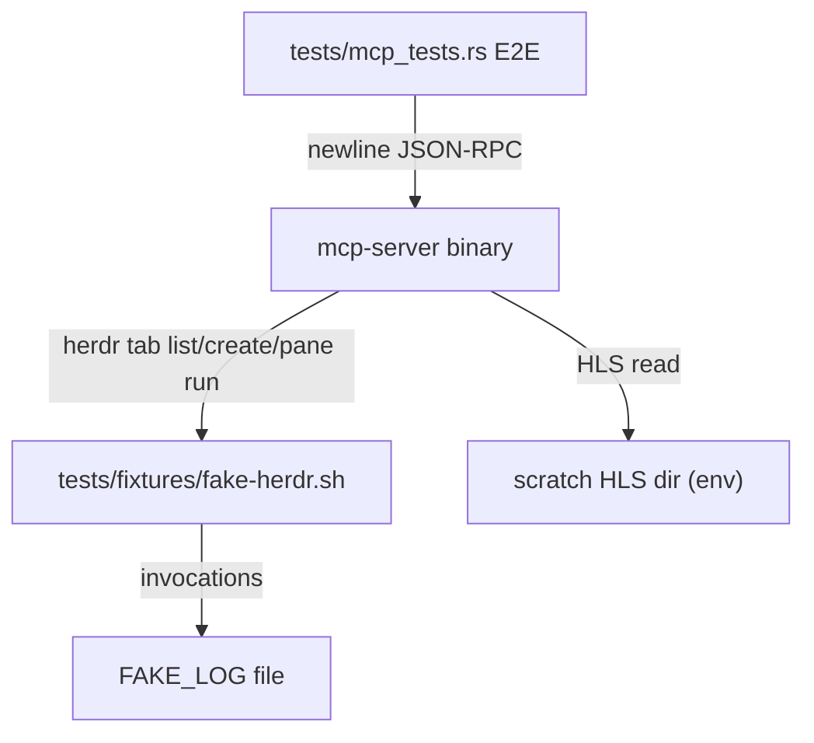

# chromecast-tv-mirror — spec-03: mcp-server (part 3/3)

- **Project**: `/projects/chromecast-tv-mirror`
- **Priority**: prove the whole server over a real stdio pipe — the E2E handshake and the R10 acceptance test that a server corrupting stdout or panicking on a tool error must fail
- **Status**: **DONE** — implemented by pi-workhorse (deepseek-v4-flash),
  orchestrator-reviewed and committed 2026-08-17 (commit `beda887`); 14/14 exit
  criteria green (incl. wrong-version-first proof); HANDOFF updated. Master
  spec-03 is now IMPLEMENTED — awaiting review; phase-8 live TV verification is
  the next orchestrator/operator step. · *(lifecycle: SPECIFIED → IN PROGRESS on
  dispatch → IMPLEMENTED — awaiting review → DONE after the orchestrator commits
  and updates HANDOFF.md)*
- **Source**: operator requirement: MCP-over-stdio Chromecast control server; split of specs/03-mcp-server.md after two stalled workhorse runs (2026-08-16)
- **Depends-On**: **`specs/03-mcp-server-part2.md` MUST have landed first** (the `McpServer`, `bin/mcp-server.rs`, and the mux/Runner seams). The master spec `specs/03-mcp-server.md` is the source of truth.

---

## Verified Premises

<Checked in the tree / verified against the build on 2026-08-16.>

- After part 2: `src/bin/mcp-server.rs` exists, wired to `serve_stdio()`
  (`server.serve(stdio()).await?.waiting().await?`); `serverInfo.name ==
  "cast-tv-terminal"` is set by the `ServerHandler` (rmcp's initialize returns
  it; the E2E asserts it).
- `cargo` sets `env!("CARGO_BIN_EXE_mcp-server")` for integration tests when a
  `[[bin]] mcp-server` exists — the E2E spawns the REAL binary.
- The mux drivers construct lazily (part 1): a missing `HERDR_SOCKET_PATH`
  socket fails on the first mux command, NOT at `mux::open()` — so a server
  started with a bad socket path comes up, and the failing tool returns
  `is_error`. This is what the acceptance test drives.
- herdr CLI subcommands accept a `HERDR_SOCKET_PATH` env override on every
  invocation (verified in milestone-2: `HERDR_SOCKET_PATH=<socket> herdr tab
  list`).

---

## Overview

Parts 1 and 2 built the server and its seams. **This part proves it end-to-end
over a real stdio pipe.** Two `#[tokio::test]`s spawn the built `mcp-server`
binary against a fake-herdr shim and a scratch HLS dir, drive newline-delimited
JSON-RPC over the child's stdin/stdout, and assert on what the consumer — the
MCP client — actually receives.

This is where the two most dangerous defects would surface: a server that
`println!`s debug output corrupts the protocol and the handshake/`tools/list`
round-trips break; a server that `.unwrap()`s a missing mux socket dies and the
`tools/list` after a failed call is never answered. **The acceptance test
requires the wrong version first:** ship a stub `mcp-server` whose `cast_text`
does `println!("handling cast_text")` and `.unwrap()`s the mux call, watch both
E2E tests fail, then fix and paste both outputs.

---

## Requirements

Implements the master spec's R1 *proof* (stdio server, initialize handshake, 7
tools, tools/call served for its lifetime, protocol-only stdout) and the R10
**acceptance test** (a failing tool returns a well-formed `is_error` result and
the server keeps serving). Re-asserts N1, N3, N4.

### Functional

- **R1 (stdio server, PROVEN)**: spawning the built `mcp-server` and driving
  newline JSON-RPC must complete the `initialize` handshake
  (`serverInfo.name == "cast-tv-terminal"`, `capabilities.tools` present),
  return **all seven tool names** from `tools/list`, and serve `tools/call`
  without any non-protocol bytes on stdout.
- **R10 (error surface, PROVEN)**: a failing tool call returns a well-formed
  `is_error` result AND a subsequent `tools/list` is still answered — the
  process is alive. A corrupted stdout or a panic would fail this.

### Non-Functional

- **N1**: no `.unwrap()`/`.expect()`/`panic!()` in `src/mcp` or `src/mux` (the
  8-dir meta-test covers everything; the E2E drives the real binary so a panic
  is a hard failure).
- **N3**: gates stay green; the test count only goes up.
- **N4 (stdio discipline, PROVEN at the pipe)**: children spawned by the server
  must not inherit or corrupt the server's stdout. The E2E asserts clean
  JSON-RPC on stdout despite a tool call that spawns a child (the fake herdr
  shim under `HERDR_SOCKET_PATH`).

---

## Architecture

The E2E test sets `MUX=herdr`, `HERDR_SOCKET_PATH` to a **fake socket path**,
`HLS_DIR` to a scratch dir the test populates, and a `PATH` whose first entry is
a temp dir containing a `herdr` symlink → the fixture, so the herdr driver's
`Command::new("herdr")` resolves to the shim (the driver always sets
`HERDR_SOCKET_PATH` itself; the shim ignores it). The shim — an executable
`tests/fixtures/fake-herdr.sh` — logs every invocation to the `$FAKE_LOG` path
from env and emits canned herdr JSON. It never touches the live stack, a real
socket, or the real herdr.

**Key decision — the shim, not the real herdr.** The E2E must be deterministic
and runnable on any machine; a fake script under the repo's `tests/fixtures/`
keeps it that way. The script answers `tab list` with an existing `agent` tab so
`cast_text` proceeds to a `pane run` whose invocation lands in `FAKE_LOG`.

**What this part is not**: production code changes (only tests + a fixture);
live TV verification (orchestrator/operator step after this part lands);
installing tmux.

---

## TDD Contract

Extends `tests/mcp_tests.rs`. Both tests spawn `env!("CARGO_BIN_EXE_mcp-server")`
with `MUX=herdr`, `HERDR_SOCKET_PATH` → a path that routes to the fake shim,
`HLS_DIR` → scratch, stdio piped; the test writes newline-delimited JSON-RPC
frames to stdin and parses newline-delimited responses from stdout.

| id | test | given | expects |
|----|------|-------|---------|
| R1 | `test_e2e_stdio_handshake` | spawn the built `mcp-server` (fake herdr shim + scratch HLS dir), drive `initialize` → `notifications/initialized` → `tools/list` → `tools/call cast_text` | initialize answered (`serverInfo.name == "cast-tv-terminal"`, capabilities.tools present); `tools/list` → all 7 names; `cast_text` → success result AND `FAKE_LOG` contains the `pane run` invocation |
| R1,R10 | `test_e2e_tool_error_keeps_server_alive` (ACCEPTANCE) | spawn the server with a mux socket path that FAILS (shim exits non-zero / missing socket), `tools/call cast_text` | first call → well-formed `is_error` result (not a JSON-RPC error, not a hang); `tools/list` again → still answered; process alive. **Write the wrong version first**: stub `mcp-server` whose `cast_text` does `println!("handling cast_text")` and `.unwrap()`s the mux call; watch this test fail (protocol corruption / connection reset); then fix and paste BOTH outputs. |

**R10 (acceptance test) — `test_e2e_tool_error_keeps_server_alive`.** This is
the requirement a plausible implementation satisfies in appearance only: a
server whose handlers `println!` debug output or `.unwrap()` a missing socket
still looks fine in unit tests. The E2E drives the real binary and proves BOTH:
the failed call returns a well-formed `is_error` result AND a subsequent
`tools/list` is still answered.

**Deliberately NOT exercised end-to-end**: `set_font_size`, `restore`,
`mirror_session` — they would pkill the live xterm and cycle loop. Their
behaviour is covered by part 2's `FakeRunner` tests.

---

## Exit Criteria

- [ ] `cargo build` — default features compile (R1)
- [ ] `cargo build --features cast` — cast-enabled compile (R3)
- [ ] `cargo build --features cast,gstreamer` — full feature set compiles (N3)
- [ ] `cargo test` — whole suite incl. the E2E tests (N3)
- [ ] `cargo test --test mcp_tests 2>&1 | grep -qE "^test result: ok\. [1-9]"` — the new target ran ≥1 passing test (non-vacuous) (R1-R10)
- [ ] `cargo test --quiet test_e2e_stdio_handshake 2>&1 | grep -qE "^test result: ok\. [1-9]"` — E2E handshake + 7-tool list (R1, non-vacuous)
- [ ] `cargo test --quiet test_e2e_tool_error_keeps_server_alive 2>&1 | grep -qE "^test result: ok\. [1-9]"` — acceptance: tool error → `is_error`, server alive (R10, non-vacuous)
- [ ] `cargo test --quiet test_no_production_unwrap 2>&1 | grep -qE "^test result: ok\. [1-9]"` — meta-test green (N1, non-vacuous)
- [ ] `test -f tests/fixtures/fake-herdr.sh && test -x tests/fixtures/fake-herdr.sh` — the E2E shim exists and is executable (R1)
- [ ] `cargo clippy --all-targets -- -D warnings` — clean (N3)
- [ ] `cargo fmt -- --check` — formatted (N3)
- [ ] `! grep -rn 'println!(\|print!(' src/mcp src/mux src/bin/mcp-server.rs` — no stdout writes in server code (N4)
- [ ] `! grep -rn '/projects/chromecast-tv-mirror\|/root/' src/mcp src/mux src/bin/mcp-server.rs` — no hardcoded absolute paths (N5,N6)
- [ ] `! git diff --name-only | grep -qE 'specs/(01|02)-|^src/(capture|emu|render|encode|serve|cast)/'` — prior pipeline modules and specs untouched (N1)

**Prose criteria:**

1. The "wrong version first" proof is in the workhorse's reply: the stub
   `cast_text` (println + unwrap) failing BOTH E2E tests, then the fixed version
   passing, with both outputs pasted.
2. Test counts pasted raw, one line per binary, **unsummed**.
3. Live TV verification is a separate orchestrator/operator step after review
   (register via `claude mcp add`, cast_url/cast_text/set_font_size/
   mirror_session/restore on the TV, tmux parity) — NOT part of this dispatch.

---

## Guardrails

- **G1 — do NOT edit this spec, or the master spec `specs/03-mcp-server.md`.** If
  either is wrong, STOP and report it to the orchestrator.
- **G2 — do NOT commit.** Leave work in the working tree.
- **G3 — do NOT weaken, skip or delete an existing test** (parts 1-2 included).
- **G4 — do NOT regenerate a pinned fixture.**
- **G5 — no hardcoded absolute paths in production code.** Test artefacts under
  `_tmp/` or the scratch HLS dir the test creates.
- **G6 — report raw output, never summed totals.**
- **G7 — do NOT touch the operator's live default herdr session, and do NOT kill
  operator processes** (Xvfb, ffmpeg, hls_server, the herdr server, or the
  running cycle loop). The E2E runs against the FAKE shim only — never the real
  socket, never a real xterm.
- **G8 — do NOT install system packages** (tmux, fonts, etc.).
- **G9 — do NOT run `cargo add`.** Edit `Cargo.toml` directly; keep the spec-02
  rustix `std` pin. If rmcp's rustix conflicts, report it — never remove the pin.
- **G10 — stdio discipline.** The E2E asserts it: stdout carries only JSON-RPC.

### Error handling expectations

Fail loudly, never silently:
- The shim exiting non-zero → the server's mux command fails → the tool returns
  `is_error` (never a JSON-RPC error, never a hang, never a panic).
- A corrupted stdout (any non-JSON-RPC byte) → the E2E test fails.
- `initialize` not answered → the E2E test fails (server not alive / wrong
  transport).

---

## Files to Modify

| File | Change |
|------|--------|
| `tests/mcp_tests.rs` | **EXTEND** — `test_e2e_stdio_handshake`, `test_e2e_tool_error_keeps_server_alive` (R1,R10) |
| `tests/fixtures/fake-herdr.sh` | new — executable fake herdr shim: logs every invocation line to `$FAKE_LOG`, emits canned JSON for `tab list`/`tab create`/`pane run` (R1) |

**Not modified**: any `src/` file (production code is complete after part 2),
`Cargo.toml`, `specs/*` (orchestrator owns them), `.orchestration/`,
`HANDOFF.md`, `docs/`.

---

*Part 3 is the last part. When it lands and the orchestrator commits, the
master spec-03's status moves to IMPLEMENTED — awaiting review, then the live
TV verification (phase 8) runs.*
