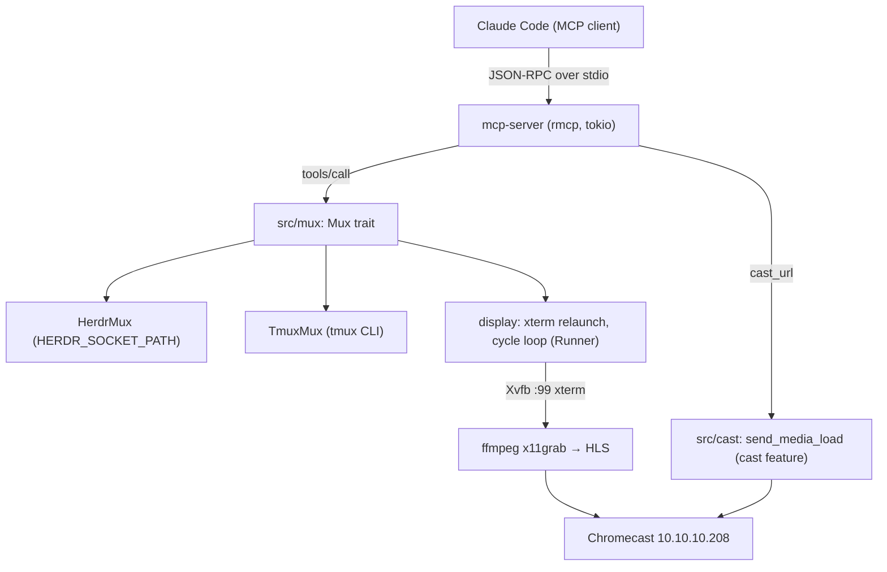

# chromecast-tv-mirror — spec-03: mcp-server

- **Project**: `/projects/chromecast-tv-mirror`
- **Priority**: the operator's next must after the live-framebuffer milestone: an AI agent must be able to drive the Chromecast and the TV terminal stack from Claude Code, and see its own interaction on the TV
- **Status**: SPECIFIED — not yet dispatched · *(lifecycle: SPECIFIED → IN PROGRESS
  on dispatch → IMPLEMENTED — awaiting review → DONE after the orchestrator
  commits and updates HANDOFF.md)*
- **Split for dispatch (2026-08-16)**: implemented as three parts —
  `03-mcp-server-part1.md` (mux core + mcp foundation + unit tests),
  `03-mcp-server-part2.md` (server surface + bin), `03-mcp-server-part3.md`
  (E2E + acceptance). This file remains the source of truth; the parts carry
  the same requirements, R-numbers and guardrails, subset per part.
- **Source**: operator requirement: MCP-over-stdio server so an AI agent controls the Chromecast + TV terminal stack; approved plan /root/.claude/plans/inherited-inventing-wren.md (2026-08-16)
- **Depends-On**: spec-01 (reuses `src/cast` + the gate/test conventions), spec-02 (keeps the rustix `std` pin and the no-unwrap meta-test)

---

## Verified Premises

<Every load-bearing claim was read in the tree on 2026-08-16 before writing.>

- `src/lib.rs:4-11` — public modules are exactly `capture, cast, damage, emu,
  encode, pipeline, render, serve`; there is no `mcp` or `mux` module yet.
- `Cargo.toml:7-34` — deps: tokio 1 (full), axum 0.7, serde+serde_json, thiserror,
  log 0.4, alacritty_terminal 0.24, tiny-skia 0.11; optional `rust_cast 0.17`
  under `cast`; features `default=[]`, `gstreamer`, `cast`. No rmcp. `rustix
  0.38.44` pinned with the `std` feature (spec-02 upstream-defect pin).
- `src/cast/session.rs:25-38,47-55` — whole module `#[cfg(feature="cast")]`;
  `pub fn send_media_load(&DeviceAddr, &str, &str, StreamType) -> Result<(),
  CastError>`; `pub use rust_cast::channels::media::StreamType`.
- `src/cast/sender.rs:26-41` — `DeviceAddr::new(host)` sets port 8009;
  `CastError` variants DiscoveryFailed/Unreachable/Session.
- `src/bin/castctl.rs:23-31,76-82` — `stream_type_for`: `image/*`→NONE,
  `video/mp4`→BUFFERED, else LIVE; castctl maps back to
  `StreamType::{None,Buffered,Live}` only inside `#[cfg(feature="cast")]` and
  compiles (sends nothing) without the feature.
- `tests/cast_tv_tests.rs:646-712` — `test_no_production_unwrap` walks
  `module_dirs = [capture,emu,render,encode,serve,cast]` and asserts
  `checked_dirs.len() == 6`. Extending the list to add `mcp` and `mux` (→8) is a
  one-line change in that test.
- Live runtime (verified on the box, 2026-08-16): tv-demo herdr socket
  `/root/.config/herdr/sessions/tv-demo/herdr.sock`; tabs `w1:t1` (htop) +
  `w1:t2` (`watch -n 5 lsof -i tcp`) cycling every 10 s via a detached
  `bash -c 'while true; do … tab focus …; sleep 10; …; done'`; display xterm:
  `xterm -class XTerm -fa 'DejaVu Sans Mono' -fs 13 -geometry 116x32+0+0 -xrm
  XTerm*{scrollBar,menuBar,internalBorder,background,foreground}… -T herdr-tv -e
  /bin/sh -c 'exec herdr --session tv-demo'`; HLS out `/tmp/m2/xhls` served by
  `hls_server.py` on :18080; ffmpeg x11grab :99 → HLS. The parent env carries
  `HERDR_ENV=1` + `HERDR_SOCKET_PATH=<default-session socket>` — the
  nested-herdr hazard is live and must be neutralized on every spawn.
- rmcp 3.1.2 (docs.rs latest): features `server`,`macros`,`transport-io`,
  `schemars`; API per rust-sdk `main` examples (`counter.rs`,
  `calculator_stdio.rs`): `#[tool]`/`#[tool_router]`/`#[tool_handler]`,
  `RoleServer`, `CallToolResult::success/error`, `ServiceExt::serve(stdio())`
  then `.waiting()`.

---

## Overview

The live-framebuffer milestone put a real herdr session on the operator's
Chromecast (10.10.10.208, 720p): Xvfb :99 + xterm + ffmpeg x11grab → HLS +
hls_server :18080, with a tv-demo herdr session cycling htop and `watch lsof`.
What the operator wants next is for an **AI agent to control that TV** — cast
media, push its own text/output to the screen, resize, check health, restore —
and to **mirror any running session** (Claude Code or any bash session) on the
TV so its work is visible live. Research (MCP vs ACP vs A2A, 2026-08-16) settled
**MCP over stdio** for this agent→tool surface: ACP v2 dropped the
terminal-execution surface and A2A has no terminal primitives.

Today the crate is a library plus two one-shot CLIs (`castctl`, `mirror`).
Nothing speaks a server protocol, and nothing can drive the live stack from an
agent. This spec adds a long-lived `mcp-server` binary over MCP stdio exposing
seven tools, routing all display actions through a new `src/mux` module with two
drivers — **herdr and tmux** (the operator's explicit requirement: "a specific
herdr module (its also compatible with tmux)!") — and reusing the existing
`src/cast` leg for media LOADs.

The riskiest seam is not the protocol: it is that a naive server **panics on a
tool failure** or **writes to stdout**, either of which kills the MCP session or
corrupts it. The acceptance test pins exactly that (see TDD Contract).

---

## Requirements

### Functional

- **R1 (stdio MCP server)**: a new bin `mcp-server` runs the rmcp `ServiceExt`
  over stdio (newline-delimited JSON-RPC). It completes the initialize
  handshake, lists seven tools, and serves `tools/call` for its lifetime.
  stdout carries ONLY the protocol; every log/diagnostic goes to stderr.
- **R2 (mux module, dual-driver)**: `src/mux/` defines a shared `Mux` trait and
  exactly two drivers — `HerdrMux` (herdr socket CLI, JSON stdout) and
  `TmuxMux` (tmux `-F` formatted output) — selected by env `MUX` (default
  `herdr`). Display tools never name herdr or tmux. Both drivers satisfy the
  same contract; the contract tests run against both.
- **R3 (cast_url)**: load a media URL (HLS `.m3u8` or image) onto the configured
  Chromecast via `cast::session::send_media_load`, deriving the stream type from
  the content type (`image/*`→NONE, `video/mp4`→BUFFERED, else LIVE). The tool
  is always listed; a build without the `cast` feature returns an `is_error`
  result naming the missing feature — never a crash.
- **R4 (cast_text)**: show agent text on the TV through a dedicated mux window
  labelled `agent` (find-or-create, idempotent), focused on-screen. Text is
  escaped with a single-quote helper (`'`→`'\''`, control chars stripped except
  `\n`/`\t`) so arbitrary agent text is safe in the window's shell.
- **R5 (run_command)**: run a shell command whose output appears on the TV — the
  command is passed verbatim (not escaped) to the `agent` window's shell.
- **R6 (set_font_size)**: validate `pts ∈ 6..=32`; kill the framebuffer xterm;
  relaunch it with `-fs <pts>` re-attached to the mux session (all `HERDR_*`
  env removed — nested-herdr). Returns a confirmation.
- **R7 (pipeline_status)**: return one JSON text block: mux session + windows/
  panes, live processes (Xvfb, display xterm incl. its current `-fs`, ffmpeg
  x11grab, hls_server, the cycle loop), and HLS dir state (playlist present,
  segment count, newest segment, playlist tail). Every field degrades to an
  absent/null marker — never blocks, never panics.
- **R8 (restore)**: return the TV to the cycling htop/lsof view — kill the
  current cycle loop, optionally close the `agent` window, focus the first
  cycle window, and (unless disabled) spawn a fresh detached cycle loop and
  record its pid.
- **R9 (mirror_session)**: relaunch the display xterm attached to a live
  session — herdr `herdr --session <name>`, tmux `tmux attach-session -t <name>
  [-r]` — optionally focusing a target window. Mirrors any running
  bash/Claude session on the TV; `restore` returns to the cycle.
- **R10 (error surface)**: every tool returns `CallToolResult` — success on
  success, an `is_error` result on operational failure (mux/cast/socket/arg
  validation), and only genuinely unexpected internal state maps to a JSON-RPC
  error. A failing tool never terminates the server.

### Non-Functional

- **N1**: no `.unwrap()`/`.expect()`/`panic!()` in `src/mcp` or `src/mux`
  (the meta-test extends to 8 dirs). `?`/`match`/`ok_or` only.
- **N2**: the only new dependency is `rmcp` (+ its transitive tree). No
  clap/anyhow; no dev-dependencies; the spec-02 rustix `std` pin stays.
- **N3**: quality gates stay green — `cargo build --features cast,gstreamer`,
  `cargo test`, `cargo clippy --all-targets -- -D warnings`, `cargo fmt
  -- --check` — and the test count only goes up.
- **N4 (stdio discipline)**: stdout is the MCP protocol only. Every spawned
  child (xterm, cycle loop) gets stdin/stdout/stderr nulled and its own process
  group, so it can neither corrupt the protocol nor die with the server.
- **N5 (isolation)**: the server only ever talks to the configured mux
  socket/session (default `tv-demo`). It never inherits `HERDR_SOCKET_PATH`
  from the parent, never touches the operator's live default herdr session, and
  only kills exactly what a tool targets (the display xterm; the cycle loop
  `restore` manages).
- **N6**: no hardcoded absolute paths in production code — every runtime path/
  value comes from env with documented defaults.

---

## Architecture



### Module tree

```
src/
├── lib.rs                 EDIT: add `pub mod mcp; pub mod mux;`
├── mux/
│   ├── mod.rs             Mux trait, MuxError, Target/Pane/WindowInfo/PaneInfo,
│   │                      MuxKind, driver factory open(); (Runner seam lives in
│   │                      src/mcp/runner.rs — see below)
│   ├── herdr.rs           HerdrMux — socket subcommands, JSON stdout
│   └── tmux.rs            TmuxMux — tmux CLI, -F formatted output
├── mcp/
│   ├── mod.rs             McpServer struct + #[tool_router] (7 tools) +
│   │                      #[tool_handler] ServerHandler + serve_stdio()
│   │                      — the ONLY file importing rmcp
│   ├── config.rs          Config + from_env(): MUX, CAST_DEVICE, socket path,
│   │                      HLS_DIR, agent label, cycle labels/secs, X display,
│   │                      geometry, pid-file
│   ├── runner.rs          Runner trait (run, spawn_detached) + ProcRunner;
│   │                      captures parent HERDR_* keys, applies env_remove +
│   │                      env_set, nulls stdio, process_group(0)
│   ├── cast.rs            CastUrlArgs, CastPort closure, production_cast_port(),
│   │                      stream_type_for(), parse_stream_type()
│   ├── display.rs         set_font_size(), restore(), mirror_session(),
│   │                      cycle-loop spawn
│   ├── status.rs          pipeline_status() collector
│   └── errors.rs          McpServerError (thiserror)
└── bin/
    └── mcp-server.rs      stdio entrypoint: stderr logger, Config::from_env,
                           mux::open(), wiring, serve(stdio()).waiting()
```

### Key decisions

**Key decision — Mux trait over protocol-specific backends.** All display tools
call the `Mux` trait (`ensure_window`, `focus`, `send_text`, `run_command`,
`close_window`, `list_windows`, `list_panes`, `shell_focus_line`,
`attach_shell`); `HerdrMux` and `TmuxMux` implement it. **Rejected:** tools
calling the herdr CLI directly. The operator's requirement is explicit — the
display layer must work with herdr AND be tmux-compatible — and a future
full-screen "card" backend is a third impl, no tool changes.

**Key decision — Runner process seam.** All subprocess work goes through
`Runner { run, spawn_detached }` with `ProcRunner` production semantics: remove
every captured `HERDR_*` env key, apply the per-call env (always
`HERDR_SOCKET_PATH=<configured socket>` for herdr; `DISPLAY=<X>` for xterm),
null stdio, and `process_group(0)` so children detach. **Rejected:** tools
spawning `std::process::Command` inline — that is what made the nested-herdr
bug and stdio corruption possible, and it is untestable.

**Key decision — MCP via rmcp over stdio, tools as the whole surface.**
**Rejected:** ACP (v2 removed the terminal-execution surface; no fit) and A2A
(agent-to-agent RPC with no terminal primitives). tmux-via-Bash stays the
recommendation for interactive terminal control inside Claude Code; this server
owns the cast/display surface.

**Key decision — cast_url is feature-gated, not absent.** The tool is always
listed so the model sees the capability; `production_cast_port()` is
`#[cfg(feature="cast")]` (real `send_media_load`) vs a stub error otherwise.
`StreamType`/rust_cast types never appear outside the `cfg(cast)` body — the
`CastPort` closure takes `&str`.

**Key decision — agent text goes to a dedicated `agent` window initially.**
**Rejected:** a full-screen card renderer for this milestone. The trait seam is
the swap point; the operator asked to "keep it flexible".

**What this spec is not**: no HTML/JS graphical dashboard (future research), no
audio work (separate milestone), no changes to the existing pipeline modules or
the `mirror` emulator, no installation of tmux (live tmux parity is an
orchestrator/operator step after review), no changes to the operator's live
default herdr session.

### Config (env, all with defaults)

`MUX` (herdr), `MUX_SESSION` (tv-demo), `MUX_SOCKET`
(`/root/.config/herdr/sessions/tv-demo/herdr.sock`), `MUX_WORKSPACE` (w1),
`MUX_AGENT_LABEL` (agent), `MUX_CYCLE_LABELS` (1,watch), `MUX_FOCUS_SECS` (10),
`CAST_DEVICE` (10.10.10.208), `HLS_DIR` (`/tmp/m2/xhls`), `CYCLE_PID_FILE`
(`/tmp/m2/tv_cycle.pid`), `X_DISPLAY` (:99), `XTERM_GEOMETRY` (116x32+0+0).

---

## TDD Contract

New `[[test]]` target `tests/mcp_tests.rs` (no dev-deps; `FakeRunner` scripts a
queued `CommandOutcome` and logs every `(cmd,args,env,remove_env)` call;
`FakeMux` records tool-level calls; `FakeCastPort` records `(host,url,ct,st)`).
Mux-contract tests run against BOTH drivers.

| id | test | given | expects |
|----|------|-------|---------|
| R1 | `test_e2e_stdio_handshake` | spawn the built `mcp-server` (fake herdr shim + scratch HLS dir), drive newline JSON-RPC | `initialize` → `serverInfo.name == "cast-tv-terminal"`, `capabilities.tools` present; `tools/list` → all 7 tool names |
| R1,R10 | `test_e2e_tool_error_keeps_server_alive` | `tools/call cast_text` against a missing mux socket, then `tools/list` again | first call → `is_error` result; second `tools/list` still answered → process alive |
| R3 | `test_stream_type_for_mapping` | `image/jpeg`, `video/mp4`, `application/vnd.apple.mpegurl` | `NONE`, `BUFFERED`, `LIVE` |
| R3 | `test_cast_url_forwards_to_port` | `McpServer` with `FakeCastPort` | records `(device@8009, url, ct, st)`; success text returned |
| R3 | `test_cast_port_stub_without_cast` (`#[cfg(not(feature="cast"))]`) | call `production_cast_port()` | `Err` containing `"without the cast feature"` |
| R4 | `test_shell_single_quote` | `it's here`, plus NUL/control bytes | `'it'\''s here'`; control chars stripped except `\n`/`\t` |
| R4,R5 | `test_herdr_commands_and_env` | `FakeRunner` scripted `tab list`→empty, `tab create`, re-list→`w1:t9`, `pane list` | exact argv: `tab list` → `tab create --workspace w1 --label agent --no-focus` → `tab list` → `tab focus w1:t9` → `pane run w1:p9 "printf '%s\n' '…'"`; every call has `HERDR_SOCKET_PATH` set and no inherited `HERDR_*` keys |
| R2 | `test_mux_contract_both_drivers` | same canned inputs to `HerdrMux` and `TmuxMux` | both create/find, focus, run, list; per-driver argv (`herdr …` vs `tmux …`); identical `WindowInfo`/`PaneInfo` |
| R2 | `test_mux_malformed_output` | herdr garbage JSON / tmux non-zero exit | `Err(MuxError)` containing the raw output; no panic |
| R6 | `test_set_font_size_relaunch` | `FakeRunner` pgrep→`[1234]` | `kill(1234)` then `spawn` argv contains `-fs 15`, `DISPLAY=:99`, geometry; `remove_env` contains `HERDR_ENV` |
| R6 | `test_set_font_size_rejects_range` | `pts=100` | error result; `spawn` never called |
| R8 | `test_restore_focus_and_cycle` | `FakeMux`+`FakeRunner` | cycle-loop killed (pid file + pgrep); focus first cycle window; `spawn_detached` `bash -c` loop contains the socket and `tab focus w1:t1`; pid written; `restart_cycle=false` → no spawn |
| R9 | `test_mirror_session_relaunch` | `FakeRunner` | kill + `spawn` argv `-e /bin/sh -c 'exec herdr --session <name>'`; tmux variant `attach-session -t <name> -r` when readonly |
| R7 | `test_pipeline_status_json` | scratch HLS dir + scripted tabs/panes | text parses as JSON; `hls.last_segment` set; tabs populated; a missing piece → null/absent marker |
| R2 | `test_tool_router_registers_all_tools` | `McpServer::tool_router()` | route exists for all 7 names |
| N1 | `test_no_production_unwrap` (extend existing) | `module_dirs += mcp, mux`; count 6→8 | meta-test passes |

**R10 (acceptance test) — `test_e2e_tool_error_keeps_server_alive`.** This is
the requirement a plausible implementation satisfies in appearance only: a
server whose tool handlers `println!` debug output (corrupts the protocol) or
`.unwrap()` a missing socket (panics the process) still looks fine in unit
tests. The E2E test drives the real binary and proves BOTH: the failed call
returns a well-formed `is_error` result AND a subsequent `tools/list` is still
answered. **Write the wrong version first:** ship a stub `mcp-server` whose
`cast_text` does `println!("handling cast_text")` and `.unwrap()`s the mux call;
observe the test fail (protocol corruption / connection reset), then fix and
paste both outputs.

---

## Exit Criteria

- [ ] `cargo build` — default features compile (R1,N2)
- [ ] `cargo build --features cast` — cast-enabled compile (R3)
- [ ] `cargo build --features cast,gstreamer` — full feature set compiles (N3)
- [ ] `cargo test` — whole suite incl. the `mcp_tests` target (N3)
- [ ] `cargo test --test mcp_tests 2>&1 | grep -qE "^test result: ok\. [1-9]"` — the new target actually ran ≥1 passing test (non-vacuous) (R1-R10)
- [ ] `cargo test --quiet test_no_production_unwrap 2>&1 | grep -qE "^test result: ok\. [1-9]"` — meta-test now walks `src/mcp`+`src/mux` (N1, non-vacuous)
- [ ] `cargo clippy --all-targets -- -D warnings` — clean (N3)
- [ ] `cargo fmt -- --check` — formatted (N3)
- [ ] `! grep -rn 'println!(\|print!(' src/mcp src/mux src/bin/mcp-server.rs` — no stdout writes in server code (N4)
- [ ] `! grep -rn '/projects/chromecast-tv-mirror\|/root/' src/mcp src/mux src/bin/mcp-server.rs` — no hardcoded absolute paths (N5,N6)
- [ ] `! git diff --name-only | grep -qE 'specs/(01|02)-|^src/(capture|emu|render|encode|serve|cast)/'` — existing pipeline modules and prior specs untouched (N1)

**Prose criteria:**

1. `claude mcp add chromecast --scope project --env MUX=herdr --env
   HERDR_SOCKET_PATH=/root/.config/herdr/sessions/tv-demo/herdr.sock --env
   CAST_DEVICE=10.10.10.208 -- target/debug/mcp-server` registers cleanly; with
   the TV live, the agent calls `cast_url` (re-cast the live HLS), `cast_text`
   (text visible in the agent window on TV), `set_font_size` (live font change),
   `mirror_session` on a throwaway pane then `restore` (cycle returns) — operator
   confirms each on the TV.
2. TMUX parity: with `MUX=tmux` against a tmux-created `tv-demo` session, the
   same tool calls work (install tmux for this check only; it is not part of the
   implemented diff).
3. Test counts pasted raw, one line per binary, **unsummed**.

---

## Guardrails

- **G1 — do NOT edit this spec.** If it is wrong, STOP and report it to the
  orchestrator.
- **G2 — do NOT commit.** Leave work in the working tree.
- **G3 — do NOT weaken, skip or delete an existing test.**
- **G4 — do NOT regenerate a pinned fixture.**
- **G5 — no hardcoded absolute paths in production code.** Test artefacts under
  env temp / `_tmp/`.
- **G6 — report raw output, never summed totals.**
- **G7 — do NOT touch the operator's live default herdr session, and do NOT kill
  operator processes** (Xvfb, ffmpeg, hls_server, the herdr server, or the
  running cycle loop). The only processes a tool may kill are the display xterm
  (`set_font_size`/`mirror_session`) and the cycle loop `restore` itself
  manages. Tests never run against the live stack.
- **G8 — do NOT install system packages** (tmux, fonts, etc.). The tmux driver
  is contract-tested against a fake Runner only.
- **G9 — do NOT run `cargo add`.** Edit `Cargo.toml` directly; keep the spec-02
  rustix `std` pin. If rmcp's rustix conflicts, report it — never remove the pin.
- **G10 — stdio discipline.** Never print to stdout from the server or its
  children; children must not inherit the server's stdio.

### Error handling expectations

Fail loudly, never silently:
- Missing/unreachable mux socket or tmux server → `is_error` result naming the
  socket/session; never a panic.
- `cast` feature absent → `is_error` result naming the missing feature.
- Non-zero mux exit or malformed herdr JSON → `Err(MuxError)` with the raw
  stdout/stderr included, so a wrong premise is diagnosable.
- `pgrep` with no match → treated as absence (fine), never an error.
- `pts` out of 6..=32 → invalid-argument error; no side effects.
- A tool failure → `CallToolResult::error(...)`, and the server keeps serving.

---

## Files to Modify

| File | Change |
|------|--------|
| `Cargo.toml` | add `rmcp = { version = "3", features = ["server","macros","transport-io","schemars"] }`; add `[[test]] name="mcp_tests" path="tests/mcp_tests.rs"` (R1) |
| `src/lib.rs` | add `pub mod mcp;` and `pub mod mux;` (R1,R2) |
| `src/mux/mod.rs` | new — Mux trait, MuxError, Target/Pane/WindowInfo/PaneInfo, MuxKind, driver factory (R2) |
| `src/mux/herdr.rs` | new — HerdrMux driver (R2,R4,R5) |
| `src/mux/tmux.rs` | new — TmuxMux driver (R2,R4,R5) |
| `src/mcp/config.rs` | new — Config + from_env() (N6) |
| `src/mcp/runner.rs` | new — Runner trait + ProcRunner (N4,N5) |
| `src/mcp/cast.rs` | new — CastUrlArgs, CastPort, production_cast_port(), stream_type_for() (R3) |
| `src/mcp/display.rs` | new — set_font_size(), restore(), mirror_session() (R6,R8,R9) |
| `src/mcp/status.rs` | new — pipeline_status() (R7) |
| `src/mcp/errors.rs` | new — McpServerError (R10) |
| `src/mcp/mod.rs` | new — McpServer + 7 tools + ServerHandler + serve_stdio() (R1-R10) |
| `src/bin/mcp-server.rs` | new — stdio entrypoint (R1) |
| `tests/mcp_tests.rs` | new — contract/tool/E2E tests (R1-R10) |
| `tests/cast_tv_tests.rs` | EDIT — extend `test_no_production_unwrap` module list + count 6→8 only (N1) |

**Not modified**: `src/capture|emu|render|encode|serve|cast/`,
`src/bin/castctl.rs`, `src/bin/mirror.rs`, `specs/01-*`, `specs/02-*`,
`.orchestration/`, `HANDOFF.md` (orchestrator owns it), `docs/`.
