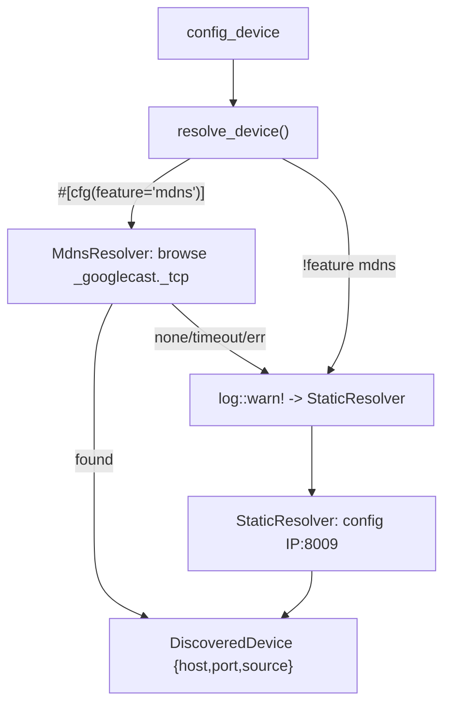

# chromecast-tv-mirror — spec-04: mdns discovery (part 1/3)

- **Project**: `/projects/chromecast-tv-mirror`
- **Priority**: core resolver module — self-contained, no wiring yet
- **Status**: SPECIFIED — not yet dispatched
- **Source**: spec-split of 04-mdns-discovery.md (laguna context limit) (2026-08-18)
- **Depends-On**: none

---

## Verified Premises

- `src/cast/mod.rs` — exists, declares `pub mod sender;` etc. A new
  `pub mod discovery;` plus re-export goes here.
- `src/cast/` — already-walked by the `test_no_production_unwrap` meta-test
  (count stays 8; a new `discovery.rs` needs NO count edit).
- `Cargo.toml [features]` — has `default = []`, optional `cast`, `gstreamer`.
  Adding `mdns = ["dep:mdns-sd"]` + optional `mdns-sd` is the only Cargo change.

---

## Overview

This is part 1 of the mDNS-discovery feature. It lands the **self-contained
resolver module** with zero wiring: the trait, the error type, the two
infallible/fallback impls, and the total `resolve_device` entrypoint. It adds
the `mdns-sd` dependency and the `mdns` feature but does NOT yet wire anything
into the cast port or status — those are parts 2 and 3.

Kept deliberately small so a slow local worker (laguna) can finish one landed
increment: it creates one new file and touches Cargo.toml's features only.

---

## Requirements

### Functional

- **R1 (resolver trait)**: `src/cast/discovery.rs` defines
  `pub trait DeviceResolver: Send + Sync` with
  `fn resolve(&self) -> Result<DiscoveredDevice, DiscoveryError>`.
  `DiscoveredDevice { host: String, port: u16, source: DiscoverySource }`;
  `DiscoverySource` enum `{ Mdns, Config }`. Trait is object-safe.
- **R2 (StaticResolver fallback)**: `StaticResolver { host: String }`
  implements `DeviceResolver`, returns
  `Ok(DiscoveredDevice { host, port: 8009, source: Config })`.
- **R3 (MdnsResolver, feature-gated)**: `#[cfg(feature = "mdns")]`
  `MdnsResolver { config_device: String, timeout_secs: u64 }` implements
  `DeviceResolver` by browsing `_googlecast._tcp` via `mdns-sd`, waiting up to
  `timeout_secs` for a `ServiceResolved`. Exactly one → use it; multiple →
  prefer the one matching `config_device` else first; none/timeout/error →
  `Err(DiscoveryError)`.
- **R4 (total entrypoint)**: `pub fn resolve_device(config_device: &str) ->
  DiscoveredDevice` runs `MdnsResolver` (when feature on) and on ANY `Err`
  falls back to `StaticResolver`. NEVER returns `Err`, NEVER panics; logs a
  `warn!` on fallback.

### Non-Functional

- **N1**: no `.unwrap()`/`.expect()`/`panic!()` in `src/cast/discovery.rs`
  (the existing meta-test walks `src/cast`).
- **N2**: only new dep is `mdns-sd = { version = "0.11", optional = true }` +
  feature `mdns = ["dep:mdns-sd"]`. Default build pulls no mDNS code.
- **N3**: gate stays green; test count only goes up.

---

## Architecture

**Key decision — resolver trait, not the existing `Discovery` box.** `sender.rs`
has `type Discovery = Box<dyn FnMut() -> Result<DeviceAddr, CastError>>` but it
is panicky-on-miss and returns `DeviceAddr` directly. This spec adds a
best-effort, never-fatal `DeviceResolver` returning `DiscoveredDevice` with a
`source` tag. They coexist.

**What this spec is not**: no wiring into `production_cast_port`, `status.rs`,
or the mcp-server bin (parts 2, 3). No change to `mirror.rs`/`castctl.rs`.

---

## TDD Contract

Tests in the existing `tests/mcp_tests.rs` target. A `FakeResolver` (mocked
`DeviceResolver`) scripts results; no test enables `mdns` or touches the network.

| id | test | given | expects |
|----|------|-------|---------|
| R2 | `test_static_resolver_returns_config` | `StaticResolver { host: "10.10.10.208" }` | `Ok(DiscoveredDevice{host:"10.10.10.208",port:8009,source:Config})` |
| R1,R4 | `test_resolve_device_falls_back_on_err` | `FakeResolver` returns `Err(Timeout)`, `resolve_device` wired to it then `StaticResolver` | `Ok` with `source:Config`, configured host; never `Err`, never panic |
| R4 | `test_resolve_device_uses_mdns_result` | `FakeResolver` returns `Ok(DiscoveredDevice{host:"192.168.1.55",port:8009,source:Mdns})` | `resolve_device` returns that device unchanged |
| R3 | `test_mdns_resolver_struct_exists` (`#[cfg(feature="mdns")]`) | build with `--features mdns` | `MdnsResolver` type compiles; has `config_device` + `timeout_secs` fields |

**R4 is the acceptance test.** `test_resolve_device_falls_back_on_err` only
passes if `resolve_device` catches the `Err`, logs, and returns the
`StaticResolver` result — the invariant that makes discovery safe on a quiet
LAN.

---

## Exit Criteria

- [ ] `cargo build` — default features compile (mDNS code absent) (N2)
- [ ] `cargo build --features mdns` — MdnsResolver compiles against mdns-sd (R3,N2)
- [ ] `cargo test` — whole suite passes (N3)
- [ ] `cargo test --test mcp_tests 2>&1 | grep -qE "^test result: ok\. [1-9]"` — resolver tests ran (non-vacuous) (R1-R4)
- [ ] `test -f src/cast/discovery.rs && grep -q "pub trait DeviceResolver" src/cast/discovery.rs && grep -q "pub fn resolve_device" src/cast/discovery.rs` — trait + entrypoint exist (R1,R4)
- [ ] `grep -q 'mdns-sd' Cargo.toml && grep -q '^mdns = ' Cargo.toml` — dep + feature declared (N2)
- [ ] `grep -q 'pub mod discovery' src/cast/mod.rs` — module declared (R1)
- [ ] `cargo clippy --all-targets -- -D warnings` — clean (N3)
- [ ] `cargo fmt -- --check` — formatted (N3)
- [ ] `! grep -rn 'unwrap()\|expect(\|panic!' src/cast/discovery.rs` — no panicking calls (N1)
- [ ] `! git diff --name-only | grep -qE 'src/(mcp|bin|mux|emu|render|serve|capture)/|src/cast/(sender|session)\.rs'` — no wiring changes (scope)

**Prose criteria:**

1. `resolve_device` is total: paste its body; every branch returns `Ok`.
2. Test counts pasted raw, one per binary, unsummed.

---

## Guardrails

- **G1 — do NOT edit this spec.** If wrong, reply `SPEC-DEFECT: 
`.
- **G2 — do NOT commit.** Leave work in the working tree.
- **G3 — do NOT weaken, skip or delete an existing test.**
- **G4 — do NOT edit `tests/cast_tv_tests.rs`'s `checked_dirs.len()` (still 8).**
- **G5 — no hardcoded absolute paths in production code.**
- **G6 — report raw output, never summed totals.**
- **G7 — do NOT run `cargo add`.** Edit `Cargo.toml` directly; keep the spec-02
  rustix `std` pin. If mdns-sd's rustix conflicts with the pin, STOP and report.
- **G8 — do NOT install system packages** (avahi, bonjour). mdns-sd is pure-Rust.
- **G9 — discovery is best-effort, always.** `resolve_device` never returns `Err`
  and never panics.

### Error handling expectations

- `MdnsResolver::resolve` may return `Err(DiscoveryError::{Timeout, Socket,
  NoDevices})` — EXPECTED, caught by `resolve_device`.
- `StaticResolver::resolve` is infallible.
- `resolve_device` is infallible.

---

## Files to Modify

| File | Change |
|------|--------|
| `Cargo.toml` | add `mdns-sd = { version = "0.11", optional = true }` + `mdns = ["dep:mdns-sd"]` (N2) |
| `src/cast/discovery.rs` | **NEW** — `DiscoveryError` (thiserror), `DiscoverySource`, `DiscoveredDevice`, `DeviceResolver` trait, `StaticResolver`, `#[cfg(feature="mdns")] MdnsResolver`, `resolve_device()` (R1-R4) |
| `src/cast/mod.rs` | add `pub mod discovery;` + re-export the types (R1) |
| `tests/mcp_tests.rs` | add `FakeResolver` + the resolver tests (R1-R4) |

**Not modified**: `src/mcp/**`, `src/bin/**`, `src/cast/sender.rs`, `src/cast/session.rs`, `src/mux/**`, `tests/cast_tv_tests.rs`, `specs/01-*`, `specs/02-*`, `specs/03-*`, `HANDOFF.md`.
