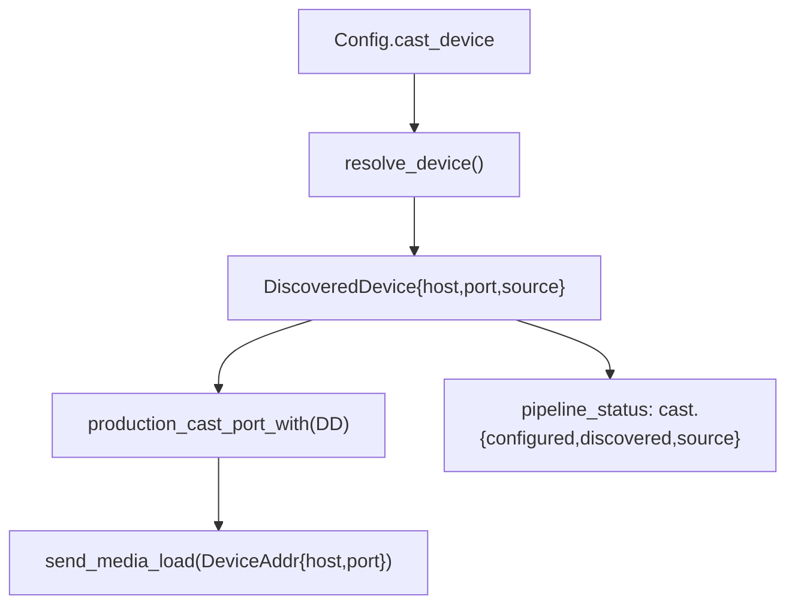

# chromecast-tv-mirror — spec-04: mdns discovery (part 2/3)

- **Project**: `/projects/chromecast-tv-mirror`
- **Priority**: wire the resolved device into the cast port
- **Status**: SPECIFIED — not yet dispatched
- **Source**: spec-split of 04-mdns-discovery.md (2026-08-18)
- **Depends-On**: spec-04-part1 (resolver module, committed e4889e1)

---

## Verified Premises

- `src/mcp/cast.rs` — `production_cast_port(device: String) -> CastPort` builds
  the closure; `cast`-feature body constructs `DeviceAddr::new(device.clone())`
  per call and calls `send_media_load`.
- `src/cast/sender.rs:25-41` — `DeviceAddr { host, port: u16 }`,
  `DeviceAddr::new(host)` sets port 8009.
- `src/cast/discovery.rs` (part1) — `DiscoveredDevice { host, port, source }`,
  `resolve_device(config_device) -> DiscoveredDevice` (total, never Err),
  `resolve_with(resolver, config_device)` seam.
- `src/mcp/mod.rs` — submodules `cast,config,display,errors,runner,sizing,status`.
- `src/bin/mcp-server.rs:47` — wires `production_cast_port(config.cast_device.clone())`.

---

## Overview

Part 1 delivered the resolver module. Part 2 wires the resolved device into
the cast port so the pipeline actually uses the mDNS-discovered host instead of
a hardcoded IP. It adds `production_cast_port_with(DiscoveredDevice) -> CastPort`
(which builds `DeviceAddr { host, port }` from the resolved device) and keeps the
existing one-arg `production_cast_port(device: String)` as a thin wrapper that
calls `resolve_device(&device)`. The mirror/castctl binaries keep compiling
unchanged (N5/G7).

---

## Requirements

### Functional

- **R5 (cast port wiring)**: `production_cast_port_with(device: DiscoveredDevice)
  -> CastPort` — the closure builds `DeviceAddr { host: device.host, port:
  device.port }` per call instead of `DeviceAddr::new(device)`. The existing
  `production_cast_port(device: String)` is refactored to call
  `production_cast_port_with(resolve_device(&device))`.
- **R6 (status surfacing)**: `pipeline_status_json` adds a top-level `cast`
  object `{ "configured_device", "discovered_device", "source" }`. Always
  present; `discovered_device` is null + source "unknown" when no device
  resolved (e.g. no cast port wired).

### Non-Functional

- **N1**: no unwrap/expect/panic in new/modified code.
- **N3**: gate green; test count only up.
- **N4**: best-effort — discovery failure never errors the pipeline.
- **N5**: `production_cast_port(device: String)` one-arg form still works;
  `mirror.rs`/`castctl.rs` NOT edited.

---

## Architecture

**Key decision — keep the one-arg wrapper.** `mirror.rs`/`castctl.rs` and
existing tests call `production_cast_port(device: String)`. Refactoring it to
delegate to the new two-arg form (which resolves) preserves their behavior with
zero edits to those binaries (N5, G7).

---

## TDD Contract

Tests in `tests/mcp_tests.rs` (existing target).

| id | test | given | expects |
|----|------|-------|---------|
| R5 | `test_production_cast_port_uses_resolved_host` (`#[cfg(not(feature="cast"))]`) | `production_cast_port_with(DiscoveredDevice{host:"9.9.9.9",port:8009,source:Mdns})` then call the port | stub `Err` message (no cast feature) — proves the closure captured the resolved host without panicking |
| R6 | `test_pipeline_status_has_cast_block` | McpServer with a resolved device wired into the cast port | `pipeline_status_json()` has `cast.configured_device`, `cast.discovered_device` = "host:port", `cast.source` |
| R6 | `test_pipeline_status_cast_block_when_no_device` | McpServer whose cast port has no resolved device | `cast.discovered_device` null, `cast.source` "unknown", `cast` object present |
| R5 | `test_one_arg_cast_port_wraps` (`#[cfg(not(feature="cast"))]`) | `production_cast_port("10.10.10.208")` then call | stub error string contains "10.10.10.208" (resolved via StaticResolver → Config source) |

**R6 acceptance** — the `cast` object is always present (never absent) so a
client can rely on it.

---

## Exit Criteria

- [ ] `cargo build` — default compiles (N3)
- [ ] `cargo test` — whole suite passes (N3)
- [ ] `cargo test --test mcp_tests 2>&1 | grep -qE "^test result: ok\. [1-9]"` — tests ran (R5,R6)
- [ ] `grep -q 'production_cast_port_with' src/mcp/cast.rs` — new form exists (R5)
- [ ] `grep -q '"cast"' src/mcp/status.rs` — cast status block exists (R6)
- [ ] `grep -q 'configured_device' src/mcp/status.rs && grep -q 'discovered_device' src/mcp/status.rs && grep -q '"source"' src/mcp/status.rs` — cast block fields (R6)
- [ ] `cargo clippy --all-targets -- -D warnings` — clean (N3)
- [ ] `cargo fmt -- --check` — formatted (N3)
- [ ] `! grep -rn 'unwrap()\|expect(\|panic!' src/mcp/cast.rs src/mcp/status.rs src/mcp/mod.rs` — no panics (N1)
- [ ] `! git diff --name-only | grep -qE 'src/bin/(mirror|castctl)\.rs'` — operator binaries untouched (N5,G7)

**Prose criteria:**
1. The one-arg `production_cast_port` still exists and delegates.
2. Test counts pasted raw, one per binary, unsummed.

---

## Guardrails

- **G1 — do NOT edit this spec.** If wrong, reply `SPEC-DEFECT: 
`.
- **G2 — do NOT commit.**
- **G3 — do NOT weaken/skip/delete an existing test.**
- **G5 — no hardcoded absolute paths.**
- **G6 — report raw output, never summed totals.**
- **G7 — do NOT edit `src/bin/mirror.rs` or `src/bin/castctl.rs`.**
- **G9 — best-effort: cast port closure never propagates a discovery error.**
- **G10 — keep the spec-02 rustix `std` pin.**

### Error handling expectations

- The cast-port closure's only `Err` is the existing `send_media_load` session
  error (unchanged) or the no-`cast` stub — never a discovery error.
- `pipeline_status` `cast` block always present; `discovered_device` null only
  when no device resolved.

---

## Files to Modify

| File | Change |
|------|--------|
| `src/mcp/cast.rs` | add `production_cast_port_with(DiscoveredDevice)`; refactor `production_cast_port(device)` to delegate (R5) |
| `src/mcp/status.rs` | add top-level `cast` object to `pipeline_status_json` (R6) |
| `src/mcp/mod.rs` | expose the resolved device so status can read it (R6) |
| `tests/mcp_tests.rs` | add the cast-port + status tests (R5,R6) |

**Not modified**: `src/bin/mirror.rs`, `src/bin/castctl.rs`, `src/cast/discovery.rs`, `src/cast/sender.rs`, `specs/*`, `.orchestration/`.
