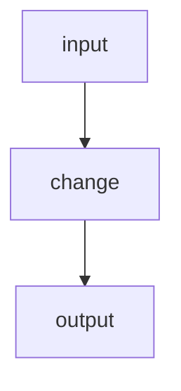

# chromecast-tv-mirror — spec-04: mdns discovery (part 2/3)

- **Project**: `/projects/chromecast-tv-mirror`
- **Priority**: <why now, in one clause>
- **Status**: SPECIFIED — not yet dispatched · *(lifecycle: SPECIFIED → IN PROGRESS
  on dispatch → IMPLEMENTED — awaiting review → DONE after the orchestrator
  commits and updates HANDOFF.md)*
- **Source**: spec-split of 04-mdns-discovery.md (laguna context limit) (2026-08-18)
- **Depends-On**: <specs that must land first, or "none">

---

## Verified Premises

<Every load-bearing claim this spec makes about existing code, checked BEFORE
dispatch. One bullet per claim, with file:line and what was confirmed. The
author verifies these by reading; the implementer re-checks only what it
touches. A premise that cannot be verified is a reason to stop and amend, not
to write "should exist".>

- `src/lib.rs:82-87` — `parse_duration` matches units `'h'|'m'|'s'` only; anything else returns `Err`
- <...>

---

## Overview

<The why. State the defect or driver concretely — quote the error, the measured
number, the failing behaviour. If a premise about existing code is load-bearing,
say you verified it and where.>

---

## Requirements

### Functional

- **R1 (short name)**: <independently checkable statement>
- **R2 (short name)**: <...>

### Non-Functional

- **N1**: <existing behaviour that must not change — this is the guard on the
  whole spec>
- **N2**: no new runtime dependencies
- **N3**: the quality gate stays green; the test count may only go up

---

## Architecture

**Key decision — <name>.** <What was chosen, what was rejected, and why. The
rejected option is what stops a reimplementation.>

**What this spec is not**: <adjacent work explicitly out of scope>

---

## TDD Contract

| id | test | given | expects |
|----|------|-------|---------|
| R1 | `test_...` | <state> | <observable result> |
| R2 | `test_...` | <state> | <observable result> |

**<id> is the acceptance test.** <Why: the requirement a plausible
implementation satisfies in appearance only. Where useful, require the wrong
version be written first and its failure pasted.>

---

## Exit Criteria

- [ ] `<runnable command>` — <what it proves> (R1)
- [ ] `<runnable command>` — <what it proves> (R2)
- [ ] `cargo test` — the whole suite, including any declared `[[test]]` target (N3)
- [ ] `cargo clippy -- -D warnings` — clean
- [ ] `cargo fmt -- --check` — formatted
- [ ] `git diff --quiet -- <forbidden path>` — that path must stay untouched (N1)
- [ ] `! git diff --name-only | grep -qE '<forbidden pattern>'` — general negative
      check. The `!` is mandatory: a bare `grep -q` exits 0 when the pattern is
      FOUND, so the validator reports PASS on a violated guard (fail-open).

**Prose criteria**:

1. <Anything requiring human judgement, stated unambiguously.>
2. Test counts pasted raw, one line per binary, **unsummed**.

---

## Guardrails

- **G1 — do NOT edit this spec.** If it is wrong, STOP and report it.
- **G2 — do NOT commit.** Leave work in the working tree.
- **G3 — do NOT weaken, skip or delete an existing test.**
- **G4 — do NOT regenerate a pinned fixture.**
- **G5 — no hardcoded absolute paths.** Test artefacts under `_tmp/`.
- **G6 — report raw output, never summed totals.**

### Error handling expectations

<What must fail loudly rather than silently. Name any path that must not default,
swallow, or treat "could not determine" as success.>

---

## Files to Modify

| File | Change |
|------|--------|
| `path` | <what> (R1) |

**Not modified**: <what stays untouched>
