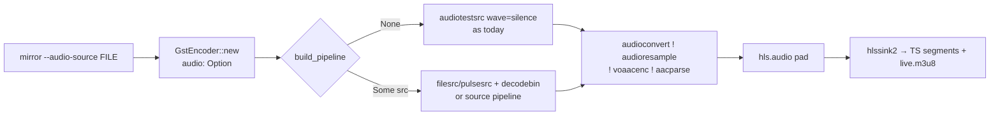

# chromecast-tv-mirror — spec-06: Real audio in the HLS stream

- **Project**: `/projects/chromecast-tv-mirror`
- **Priority**: the pipeline currently muxes a hardcoded **silent** AAC track
  (`audiotestsrc wave=silence`) because the Chromecast DMR refuses video-only
  HLS. Real audio is the remaining functional gap from the master spec's
  "audio later" note.
- **Status**: SPECIFIED — not yet dispatched
- **Source**: manual remaining-work audit (2026-08-19) — HANDOFF next-steps
- **Depends-On**: none

---

## Verified Premises

- `src/encode/pipe.rs:253-262` — `build_pipeline` hardcodes the audio leg:
  `audiotestsrc is-live=true wave=silence ! audioconvert ! audioresample !
  voaacenc bitrate=64000 ! aacparse ! hls.audio`. There is NO way to feed real
  audio into the HLS stream.
- `src/encode/pipe.rs:218` — `GstEncoder::new(encoder, width, height, fps,
  outdir, root, url)` — no audio parameter exists; the audio leg is fixed at
  silence.
- `src/bin/mirror.rs` — the `mirror` CLI has no `--audio` option.
- The container has GStreamer 1.26.2 with `pulsesrc` (PulseAudio capture),
  `filesrc` (file input), and `voaacenc` (AAC encoder) — verified via
  `gst-inspect-1.0`. So a real audio source CAN be built and tested
  in-container without the TV.
- The DMR's video-only rejection is documented in HANDOFF (2026-08-16): the
  silent AAC track is MANDATORY. **The default must remain silent AAC** so
  the stream still plays when no audio source is configured.

---

## Overview

The pipeline renders a terminal pane to video and muxes it with AAC audio into
HLS. Today the audio leg is hardcoded silence. This spec makes the audio leg
**configurable**: an optional real audio source (a file or a PulseAudio
device) can be mixed into the HLS stream, while the default stays silent AAC
so existing behavior (and the DMR's requirement) is preserved.

The driver: the user asked for audio ("we will check the audio later" →
now). Real audio lets the TV play sounds from the mirrored session (or an
audio file / system audio) instead of silence.

---

## Requirements

### Functional

- **R1 (audio source option)**: `mirror` gains a `--audio-source <path>` flag.
  When set, the GStreamer pipeline uses that audio source instead of
  `audiotestsrc wave=silence`. The source may be a media file (`filesrc`) or a
  PulseAudio device URI (`pulsesrc`).
- **R2 (default silent)**: with no `--audio-source`, the pipeline is
  byte-for-byte the current one (`audiotestsrc wave=silence`) — existing
  behavior unchanged (N1).
- **R3 (wire into encoder)**: `GstEncoder::new` (and `build_pipeline`) accept
  an `Option<AudioSource>` (or equivalent) parameter; `None` → silent,
  `Some(...)` → real source. The `NullEncoder` path is unaffected.
- **R4 (audio survives HLS)**: with an audio source configured, the muxed TS
  segments carry the real audio track — verified by inspecting the HLS
  playlist/segment with GStreamer tooling (see TDD Contract).
- **R5 (degrade safely)**: if the configured audio source cannot be opened,
  the encoder returns a clear `EncodeError` (no panic, no hang) and the
  operator sees a useful message.

### Non-Functional

- **N1**: no `--audio-source` → identical pipeline string to today (silent
  AAC preserved). This is the guard on the whole spec.
- **N2**: no new Rust dependencies (GStreamer crates already present; audio
  elements are system GStreamer plugins).
- **N3**: quality gate green; test count only goes up.
- **N4**: `--audio-source` must not break the non-gstreamer (`NullEncoder`)
  path — with default features the flag is accepted but inert (documented).

---

## Architecture

**Key decision — a source *pipeline string*, not a plugin API.** The audio
source is expressed as a GStreamer launch fragment (e.g.
`filesrc location=/tmp/song.mp3 ! decodebin ! audioconvert ! audioresample`
or `pulsesrc device=<uri> ! audioconvert ! audioresample`). The encoder
concatenates it into the main launch string. This avoids a plugin/API surface,
keeps the change small, and lets the operator pass any GStreamer-valid source.
Rejected: a fixed `filesrc`-only implementation (pulsesrc is equally valid and
cheap to support via the same mechanism).

**Key decision — default stays silent.** The DMR rejection is a hard-won
lesson (HANDOFF 2026-08-16). Making silence the default means existing
milestone-1/2 casts keep working with zero config change.

**What this spec is not**: audio capture from the *terminal itself* (a tmux
pane has no audio), volume control, audio-only streams, the operator's
milestone-2 live TV verification (separate operator step), or anything in the
mcp-server.

---

## TDD Contract

| id | test | given | expects |
|----|------|-------|---------|
| R1 | `test_mirror_accepts_audio_source_flag` | `mirror --help` output | contains `--audio-source` |
| R2 | `test_default_pipeline_has_silent_audio` | `build_pipeline(..., None, ...)` | launch string contains `audiotestsrc` and `wave=silence` |
| R3 | `test_pipeline_with_audio_source` | `build_pipeline(..., Some("filesrc location=/tmp/a.wav ! decodebin ! audioconvert ! audioresample"), ...)` | launch string contains `filesrc location=/tmp/a.wav` and does NOT contain `audiotestsrc` |
| R4 | `test_audio_source_hls_has_audio` | build a real pipeline with a generated WAV (see prose), run a few frames | `gst-discoverer`/`gst-launch` on the output TS reports an audio stream |
| R5 | `test_bad_audio_source_errors` | `GstEncoder::new` with a nonexistent file source | returns `Err(EncodeError::Gst(...))` with a clear message, no panic |

**R2 is the acceptance test.** The requirement a plausible implementation gets
wrong: replacing the silent leg unconditionally would break the DMR mandate.
`test_default_pipeline_has_silent_audio` pins the default. Write the
"always real audio" version first, watch R2 fail, then implement the
`Option<AudioSource>` gate and paste both outputs.

---

## Exit Criteria

- [ ] `cd /projects/chromecast-tv-mirror && cargo test 2>&1 | grep -qE "^test result: ok\. [1-9]"` — whole suite passes (R1-R5, N3)
- [ ] `cd /projects/chromecast-tv-mirror && cargo clippy -- -D warnings` — clean
- [ ] `cd /projects/chromecast-tv-mirror && cargo fmt -- --check` — formatted
- [ ] `cd /projects/chromecast-tv-mirror && cargo test --features gstreamer test_default_pipeline_has_silent_audio 2>&1 | grep -qE "^test result: ok\. [1-9]"` — the silent-default acceptance test passes under the gstreamer feature (R2)
- [ ] `cd /projects/chromecast-tv-mirror && ! grep -rn "audiotestsrc wave=silence" src/bin/` — the silence is no longer hardcoded in the CLI layer; it lives only in the encoder default (N1)
- [ ] `cd /projects/chromecast-tv-mirror && git diff --quiet -- specs/06-real-audio.md` — this spec must stay untouched (G1)

**Prose criteria**:

1. The R2 failure (always-real version) and its pass (Option-gated version)
   pasted raw, one line each, unsummed.
2. R4's verification: `gst-discoverer` (or `gst-launch-1.0 --print-dot` /
   `gst-inspect`) output on a generated-audio segment pasted raw, showing the
   audio stream is present.
3. Document the operator command for a real run:
   `mirror --source <pipe-pane> --audio-source 'filesrc location=/tmp/song.mp3 ! decodebin ! audioconvert ! audioresample' ...`
   (not required for the gate; manual operator step).

---

## Guardrails

- **G1 — do NOT edit this spec.** If it is wrong, STOP and report it.
- **G2 — do NOT commit.** Leave work in the working tree.
- **G3 — do NOT weaken, skip or delete an existing test.** The acceptance
  tests are load-bearing.
- **G4 — no hardcoded absolute paths.** Test artefacts under `_tmp/`.
- **G5 — no `rm -rf` of run state.**
- **G6 — report raw output, never summed totals.**

### Error handling expectations

- A bad `--audio-source` must produce a clear `EncodeError` (the encoder's
  existing `Gst(String)` variant), never a panic or a hang. The pipeline
  build already maps GStreamer errors via `map_err` — the audio-source branch
  must do the same.
- `--audio-source` on a default-features build (no `gstreamer` feature) must
  not crash: the flag is parsed, and if the encoder is `NullEncoder` it is
  accepted and ignored (documented in `--help`).

---

## Files to Modify

| File | Change |
|------|--------|
| `src/encode/pipe.rs` | `AudioSource` type (or `Option<String>` launch fragment); `build_pipeline` + `GstEncoder::new` accept it; silent default (R1-R3,R5) |
| `src/bin/mirror.rs` | parse `--audio-source`; pass to `GstEncoder::new`; document in `--help` (R1,N4) |
| `tests/cast_tv_tests.rs` | R2/R3/R5 tests (default silent, source present, bad source errors) |
| `tests/` (or `_tmp/` script) | R4 real-audio verification helper (generate a WAV, inspect output TS) |

**Not modified**: `specs/`, `src/mcp/`, `src/cast/`, `src/serve/`,
`src/render/`, `src/emu/`, `src/capture/`, `src/pipeline/`, `.orchestration/`.
